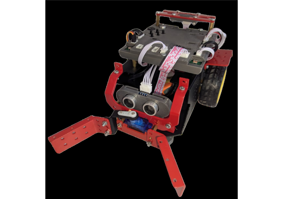

Construcción del Renabot
=========================

En esta sección aprenderá a ensamblar paso a paso el **Renabot 3 en 1**, desde la preparación del chasis hasta la primera prueba de movimiento.  

.. tip::
   Arme del robot en un área amplia y bien iluminada. Mantenga organizadas las piezas y herramientas para facilitar el proceso.

Inventario de piezas y herramientas
-----------------------------------

Lista completa de componentes incluidos en el kit:

.. list-table::
   :header-rows: 1
   :widths: 15 20 20 60

   * - N°
     - Elemento
     - Cantidad
     - Imagen de referencia
   * - 1
     - Chasis
     - 1
     - .. image:: ./img/chasis.svg
          :width: 120px
          :align: center
   * - 2
     - Guardafango I/D
     - 1
     - .. image:: ./img/guardafangos.svg
          :width: 120px
          :align: center
   * - 3
     - Acople T
     - 3
     - .. image:: ./img/acople_t.svg
          :width: 120px
          :align: center
   * - 4
     - Acople I
     - 3
     - .. image:: ./img/acople_i.svg
          :width: 120px
          :align: center
   * - 5
     - Acople servo radar
     - 1
     - .. image:: ./img/acople_ser_rad.svg
          :width: 120px
          :align: center
   * - 6
     - Acople servo gripper
     - 1
     - .. image:: ./img/soporte_servo.svg
          :width: 120px
          :align: center
   * - 7
     - Soporte ultrasónico
     - 1
     - .. image:: ./img/soporte_ultra.svg
          :width: 120px
          :align: center
   * - 8
     - Soporte frontal
     - 1
     - .. image:: ./img/soporte_frontal.svg
          :width: 120px
          :align: center
   * - 9
     - Acople gripper
     - 1
     - .. image:: ./img/acople_gripper.svg
          :width: 120px
          :align: center
   * - 10
     - Acople estructural con rodamiento
     - 2
     - .. image:: ./img/acople_rodamiento.svg
          :width: 120px
          :align: center
   * - 11
     - Ruedas de transmisión dentada
     - 2
     - .. image:: ./img/rueda_dentada.svg
          :width: 120px
          :align: center
   * - 12
     - Rueda de transmisión 375 mm
     - 2
     - .. image:: ./img/rueda_375.svg
          :width: 120px
          :align: center
   * - 13
     - Rueda de transmisión 490 mm
     - 2
     - .. image:: ./img/rueda_490.svg
          :width: 120px
          :align: center
   * - 14
     - Llantas diferencial
     - 2
     - .. image:: ./img/ruedas.svg
          :width: 120px
          :align: center
   * - 15
     - Orugas plásticas
     - 2
     - .. image:: ./img/ruedas_oruga.svg
          :width: 120px
          :align: center
   * - 16
     - Rueda loca
     - 1
     - .. image:: ./img/rueda_loca.svg
          :width: 120px
          :align: center
   * - 17
     - Switch 2 estados
     - 1
     - .. image:: ./img/switch.svg
          :width: 120px
          :align: center
   * - 18
     - Cables H-h distintos tamaños
     - 9
     - .. image:: ./img/cables.svg
          :width: 120px
          :align: center
   * - 19
     - Tornillos y tuercas M3 
     - 50
     - .. image:: ./img/tornillos_tuercas.svg
          :width: 120px
          :align: center
   * - 20 
     - Tornillos y tuercas M4 
     - 2
     - .. image:: ./img/tornillos_tuercas_m4.svg
          :width: 120px
          :align: center
   * - 21 
     - Juego sensor ultrasónico
     - 1
     - .. image:: ./img/s_ultrasonico.svg
          :width: 120px
          :align: center
   * - 22 
     - Juego sensor QTR8 
     - 1
     - .. image:: ./img/s_qtr8.svg
          :width: 120px
          :align: center
   * - 23
     - Juego pantalla OLED
     - 1
     - .. image:: ./img/oled.svg
          :width: 120px
          :align: center
   * - 24
     - Motores TT con encoder
     - 2
     - .. image:: ./img/motores_tt.svg
          :width: 120px
          :align: center
   * - 25
     - Juego sensor IMU
     - 2
     - .. image:: ./img/s_imu.svg
          :width: 120px
          :align: center
   * - 26
     - Servomotor sg90
     - 1
     - .. image:: ./img/servo.svg
          :width: 120px
          :align: center
   * - 27
     - Separadores
     - 22
     - .. image:: ./img/separadores.svg
          :width: 120px
          :align: center
   * - 28
     - Bateria
     - 1
     - A elección
   * - 29
     - Cargador
     - 1
     - .. image:: ./img/cargador.svg
          :width: 120px
          :align: center
   * - 30
     - Controlador
     - 1
     - .. image:: ./img/controlador.svg
          :width: 120px
          :align: center

Herramientas necesarias:

- Destornillador tipo estrella.   

El Renabot puede ser armado de 4 formas diferentes, **1. Velocista**, **2. Todoterreno** y **3. Exporador**.

Modos de construcción
---------------------

Modo Velocista
~~~~~~~~~~~~~~

.. figure:: ./img/rena/velocista.svg
   :alt: modelorobot
   :align: center
   :width: 400px

Rena velocista En esta modalidad, el robot utiliza la máxima potencia de sus motores y su sistema de locomoción diferencial con tres ruedas: dos motrices y una de apoyo para estabilidad.  
Permite el desplazamiento libre en el entorno y la realización de actividades como:  

* Seguimiento de inteligente de trayectorias mediante el sensor seguidor de línea.

* Evitar de obstáculos utilizando el sensor ultrasónico.  

Ejercicios de control de velocidad y giros.   

Guía de armado:

:download:`Descargar ficha Velocista <../../_static/velocista.pdf>`

Modo Velocista transportador
~~~~~~~~~~~~~~~~~~~~~~~~~~~~

La versión transportador del Renabot utiliza los Guardafangos como piezas del 
gripper que permiten transportar objetos.

Guía de armado:

:download:`Descargar ficha transportador <../../_static/velo_transportador.pdf>`

Modo Todoterreno
~~~~~~~~~~~~~~~~

.. figure:: ./img/rena/todoterreno.svg
   :alt: modelorobot
   :align: center
   :width: 400px

En esta configuración, el Renabot adopta un diseño de movilidad con orugas, lo que lo convierte en un robot todoterreno capaz de desplazarse de manera eficiente sobre superficies 
irregulares, tanto en interiores como en exteriores.
El sistema de locomoción se basa en un control diferencial de doble oruga, 
que le permite realizar giros precisos y mantener estabilidad en terrenos complejos. A través 
del sensor ultrasónico se puede programar la evasión de obstáculos o utilizar el modo automático para evitar choques.

Guía de armado:

:download:`Descargar ficha Todoterreno <../../_static/todoterreno.pdf>`

Modo Explorador
~~~~~~~~~~~~~~~

.. figure:: ./img/rena/explorador.svg
   :alt: modelorobot
   :align: center
   :width: 400px

En esta configuración, el Renabot utiliza el sistema de locomoción del modo todoterreno 
e incorpora una estructura adicional que eleva el sensor ultrasónico, montado sobre un 
servomotor SG90. Esta combinación le permite al robot simular un radar de exploración,
capaz de realizar un barrido configurable de 120° a 200º para la detección de obstáculos 
en el entorno.

De esta manera, el Rena Explorador no solo amplía sus capacidades de movilidad, 
sino que también potencia el aprendizaje en áreas como:

-	Robótica móvil avanzada y navegación autónoma.
-	Uso de sensores de proximidad con movimiento angular.
-	Implementación de mapas básicos y estrategias de exploración.

Guía de armado:

:download:`Descargar ficha Explorador <../../_static/Explorador_orig.pdf>`

Revisión final
--------------

Checklist de verificación:

- Todas las piezas atornilladas.  
- Conexiones firmes y sin falsos contactos.  
- Ruedas giran libremente.  

Prueba básica de movimiento
~~~~~~~~~~~~~~~~~~~~~~~~~~~

- Encendido inicial.  
- Verificación de motores.
- Práctica de movimiento libre.  

Revisa la sección :ref:`Práctica de movimiento libre <modo-libre>`.

.. tip::
	Para una mejor visualización del armado de las diferentes versiones del RENA-BOT revisa la tarjeta de consutrucción de la aplicación movil o escritorio

.. image:: ./img/rena.gif
   :width: 700px
   :align: center

Continúa con la revisión de los componentes electrónicos del RENA-BOT