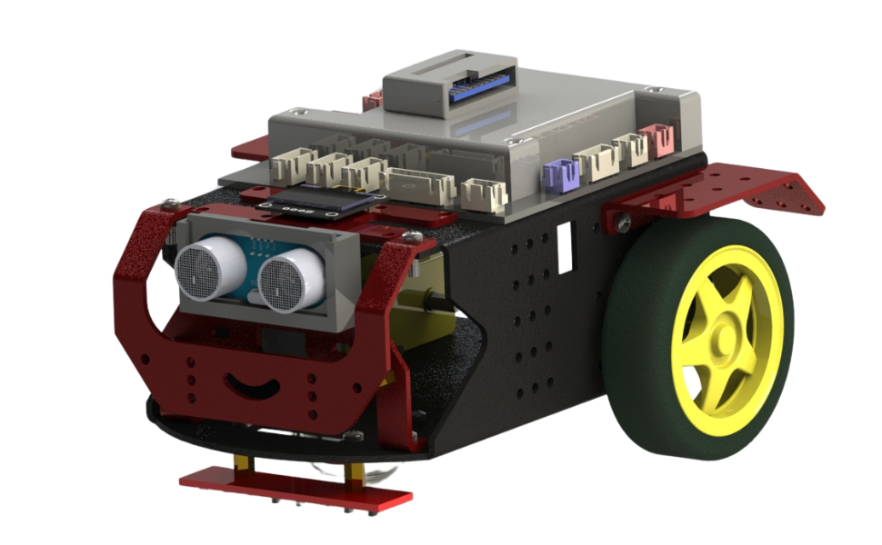
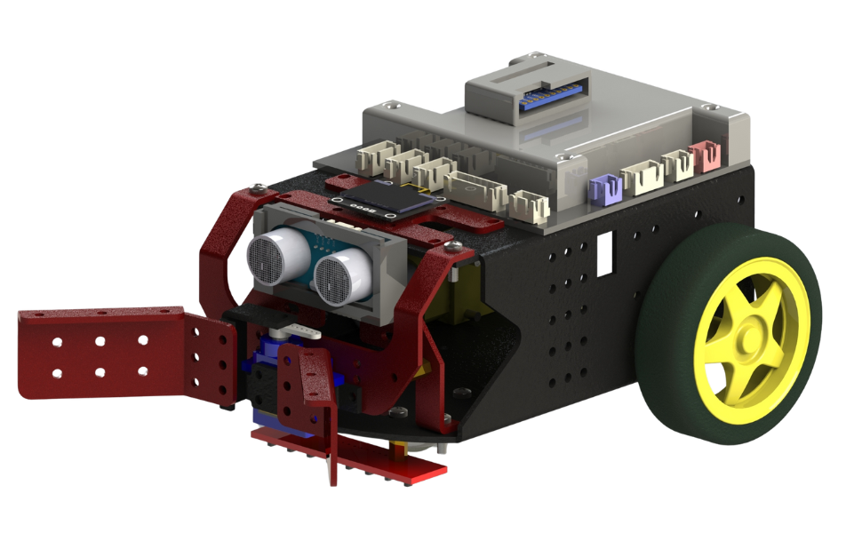
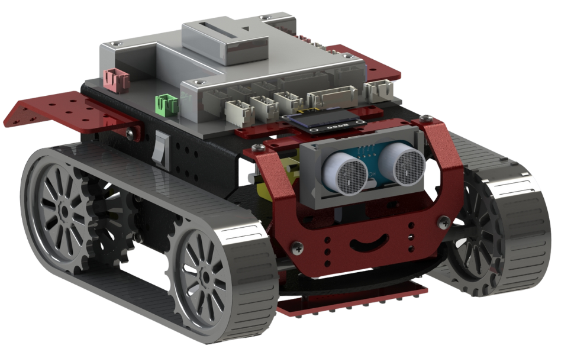
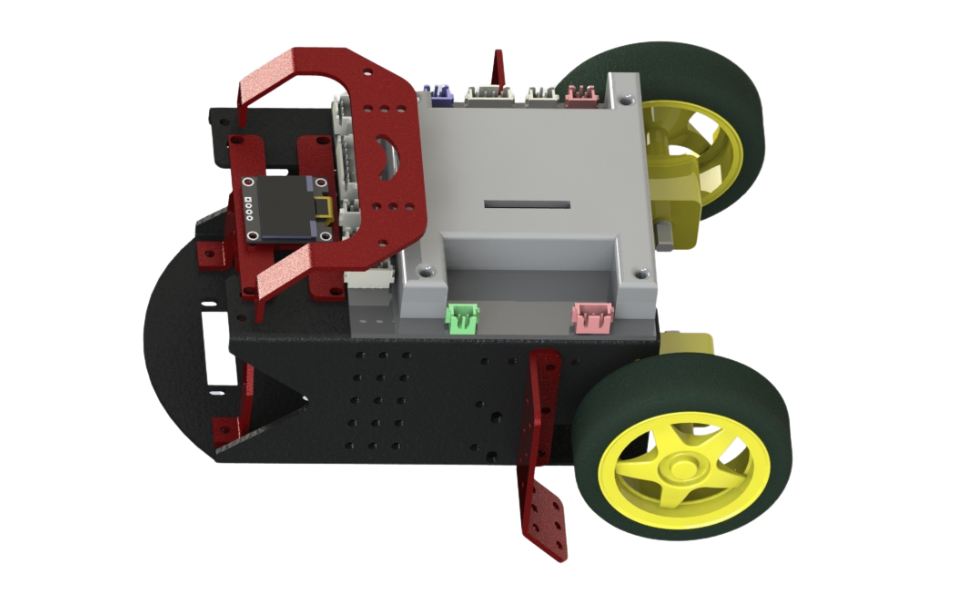

Construcción del RENA-BOT
=========================

En esta sección aprenderá a ensamblar paso a paso el **RENA-BOT Estándar**, desde la preparación del chasis hasta la primera prueba de movimiento.  

.. note::
   Se recomienda realizar el armado en un área amplia y bien iluminada. Mantenga organizadas las piezas y herramientas para facilitar el proceso.

Inventario de piezas y herramientas
-----------------------------------

Lista completa de componentes incluidos en el kit:

.. list-table::
   :header-rows: 1
   :widths: 15 20 20 60

   * - N°
     - Elemento
     - Cantidad
     - Imagen de referencia
   * - 1
     - Chasis
     - 1
     - .. image:: ./img/chasis.jpg
          :width: 120px
          :align: center
   * - 2
     - Estructura ultrasónico
     - 1
     - .. image:: ./img/estructura_ultrasonico.jpg
          :width: 120px
          :align: center
   * - 3
     - Guardafangos
     - 2
     - .. image:: ./img/guardafangos.jpg
          :width: 120px
          :align: center
   * - 4
     - Frente
     - 1
     - .. image:: ./img/frente.jpg
          :width: 120px
          :align: center
   * - 5
     - Extensión 1
     - 1
     - .. image:: ./img/extension1.jpg
          :width: 120px
          :align: center
   * - 6
     - Extensión 2
     - 1
     - .. image:: ./img/extension2.jpg
          :width: 120px
          :align: center
   * - 7
     - Soporte radar
     - 1
     - .. image:: ./img/soporte_radar.jpg
          :width: 120px
          :align: center
   * - 8
     - Soporte Pantalla
     - 1
     - .. image:: ./img/soporte_pantalla.jpg
          :width: 120px
          :align: center
   * - 9
     - Soportes Orugas delanteros
     - 2
     - .. image:: ./img/chasis.jpg
          :width: 120px
          :align: center
   * - 10
     - Estructura Servomotor
     - 1
     - .. image:: ./img/estructura_servo.jpg
          :width: 120px
          :align: center
   * - 11
     - Estructura Gripper
     - 1
     - .. image:: ./img/estructura_gripper.jpg
          :width: 120px
          :align: center
   * - 12
     - Tornillos M3 X 10
     - 25
     - .. image:: ./img/tornillo_m3_10.jpg
          :width: 120px
          :align: center
   * - 13
     - Tornillos M3 X 30
     - 4
     - .. image:: ./img/tornillo_m3_30.jpg
          :width: 120px
          :align: center
   * - 14
     - Tuercas M3
     - 30
     - .. image:: ./img/tuercas.jpg
          :width: 120px
          :align: center
   * - 15
     - Separadores plásticos M3 x 12
     - 4
     - .. image:: ./img/separador_12.jpg
          :width: 120px
          :align: center
   * - 16
     - Separadores plásticos M3 x 5
     - 4
     - .. image:: ./img/separador_12.jpg
          :width: 120px
          :align: center
   * - 17
     - Rueda loca
     - 2
     - .. image:: ./img/rueda_loca.jpg
          :width: 120px
          :align: center
   * - 18
     - Llantas
     - 2
     - .. image:: ./img/llantas.jpg
          :width: 120px
          :align: center
   * - 19
     - Cables distintos tamaños
     - 5
     - .. image:: ./img/cables.jpg
          :width: 120px
          :align: center
   * - 20
     - Protectore de circuito
     - 1
     - .. image:: ./img/placa_control.jpg
          :width: 120px
          :align: center
   * - 21 
     - Placa de control
     - 1
     - .. image:: ./img/placa_control.jpg
          :width: 120px
          :align: center
   * - 22 
     - Acople Ultrasónico
     - 1
     - .. image:: ./img/acople_ultrasónico.jpg
          :width: 120px
          :align: center
   * - 22 
     - Protección IMU
     - 1
     - .. image:: ./img/caja_imu.jpg
          :width: 120px
          :align: center
   * - 23
     - Tapa Ultrasónico
     - 1
     - .. image:: ./img/tapa_ultra.jpg
          :width: 120px
          :align: center
   * - 24
     - Sensor QTR8
     - 1
     - .. image:: ./img/seguidor_linea.jpg
          :width: 120px
          :align: center
   * - 25
     - Sensor Ultrasónico
     - 1
     - .. image:: ./img/s_ultrasonico.jpg
          :width: 120px
          :align: center
   * - 26
     - Sensor de sonido
     - 1
     - .. image:: ./img/s_sonido.jpg
          :width: 120px
          :align: center
   * - 28
     - Sensor de temperatura
     - 1
     - .. image:: ./img/s_temperatura.jpg
          :width: 120px
          :align: center
   * - 29
     - Sensor de Incercia
     - 1
     - .. image:: ./img/imu.jpg
          :width: 120px
          :align: center
   * - 30
     - Servomotor sg90
     - 1
     - .. image:: ./img/servo.jpg
          :width: 120px
          :align: center
   * - 31
     - Hélice Servomotor
     - 1
     - .. image:: ./img/helice.jpg
          :width: 120px
          :align: center
   * - 32
     - Buzzer
     - 1
     - .. image:: ./img/buzzer.jpg
          :width: 120px
          :align: center
   * - 33
     - Ejes Oruga
     - 2
     - .. image:: ./img/eje_oruga.jpg
          :width: 120px
          :align: center
   * - 34
     - Acoples orugas
     - 2
     - .. image:: ./img/guardafangos.jpg
          :width: 120px
          :align: center
   * - 35
     - Ruedas de la Oruga
     - 2
     - .. image:: ./img/ruedas_oruga.jpg
          :width: 120px
          :align: center
   * - 36
     - Cadena
     - 2
     - .. image:: ./img/cadena.jpg
          :width: 120px
          :align: center
   * - 37
     - Batería
     - 1
     - .. image:: ./img/bateria.jpg
          :width: 120px
          :align: center

Herramientas necesarias:

- Destornillador tipo estrella.   

El RENA-BOT puede ser armado de 4 formas diferentes, **1. Velocista**, **2. Equilibrista**, **3. Todoterreno** y **4. Exporador**.

Modo Velocista
--------------

Rena velocista En esta modalidad, el robot utiliza la máxima potencia de sus motores y su sistema de locomoción diferencial con tres ruedas: dos motrices y una de apoyo para estabilidad.  
Permite el desplazamiento libre en el entorno y la realización de actividades como:  

* Seguimiento de inteligente de trayectorias mediante el sensor seguidor de línea.

* Evitar de obstáculos utilizando el sensor ultrasónico.  

Ejercicios de control de velocidad y giros.   

Guía de armado:

:download:`Descargar ficha Velocista <../../_static/velocista.pdf>`

Modo Velocista transportador
----------------------------

La versión transportador del RENA-BOT utiliza los Guardafangos como piezas del 
gripper que permiten transportar objetos.

Guía de armado:

.. raw:: html

   <embed src="../../_static/velocista.pdf" type="application/pdf" width="100%" height="600px">

Modo Todoterreno
----------------

En esta configuración, el RENA-BOT adopta un diseño de movilidad con orugas, lo que lo 
convierte en un robot todoterreno capaz de desplazarse de manera eficiente sobre superficies 
irregulares, tanto en interiores como en exteriores.
El sistema de locomoción se basa en un control diferencial de doble oruga, 
que le permite realizar giros precisos y mantener estabilidad en terrenos complejos. A través 
del sensor ultrasónico se puede programar la evasión de obstáculos o utilizar el modo automático para evitar choques.

Guía de armado:

Modo Equilibrista
-----------------

En este modo, el RenaBot utiliza la información de velocidad lineal y angular presenta en el 
eje x del sensor MPU, permitiendo realizar un control sobre el avance y equilibrio del robot 
mientras avanza. Su control se realiza a través de un joystick virtual.

Guía de armado:

Modo Explorador
---------------

En esta configuración, el RENA-BOT utiliza el sistema de locomoción del modo todoterreno 
e incorpora una estructura adicional que eleva el sensor ultrasónico, montado sobre un 
servomotor SG90. Esta combinación le permite al robot simular un radar de exploración,
capaz de realizar un barrido configurable de 120° a 200º para la detección de obstáculos 
en el entorno.

De esta manera, el Rena Explorador no solo amplía sus capacidades de movilidad, 
sino que también potencia el aprendizaje en áreas como:

-	Robótica móvil avanzada y navegación autónoma.
-	Uso de sensores de proximidad con movimiento angular.
-	Implementación de mapas básicos y estrategias de exploración.

Guía de armado:

Revisión final
--------------

Checklist de verificación:

- Todas las piezas atornilladas.  
- Conexiones firmes y sin falsos contactos.  
- Ruedas giran libremente.  

Prueba básica de movimiento
---------------------------

- Encendido inicial.  
- Verificación de motores.
- Práctica de movimiento libre.  

Revisa la sección :ref:`Práctica de movimiento libre <modo-libre>`.

.. tip::
	Para una mejor visualización del armado de las diferentes versiones del RENA-BOT revisa la tarjeta de consutrucción de la aplicación movil o escritorio

.. image:: ./img/rena.gif
   :width: 700px
   :align: center

