Componentes Electrónicos
========================

Placa de Control
----------------

La placa de control del RENA-BOT contiene un diseño PCB/SMD optimizado para educación.  
Permite la integración de motores, sensores y actuadores de manera ordenada, con conectores accesibles y pines de expansión para futuros proyectos.  
Está basada en un microcontrolador ``ESP32 WROOM 1``, lo que brinda flexibilidad para programar 
el robot con distintos entornos como Arduino IDE, Micro-Python o FreeRTOS.  

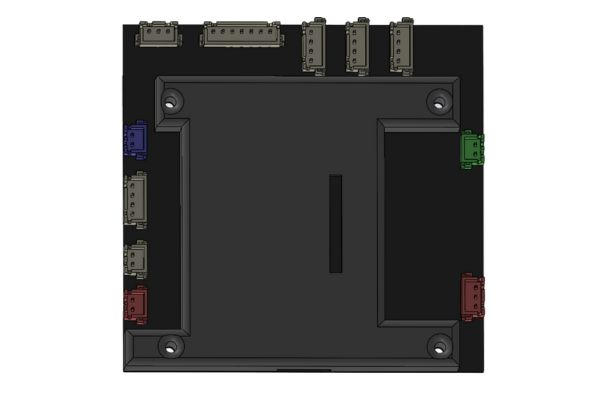

   Cerebro del RENA-BOT

Características
~~~~~~~~~~~~~~~

La placa de control del RENA-BOT ha sido diseñada con un ensamblaje de montaje superficial (SMD)**, lo que garantiza un acabado compacto, ligero y confiable.  
Sus dimensiones son 95 x 92 x 2 mm, cuenta con recubrimiento protector para mayor durabilidad y resistencia, y está optimizada para integrar de forma ordenada los diferentes módulos del robot en formato
plug and play.  

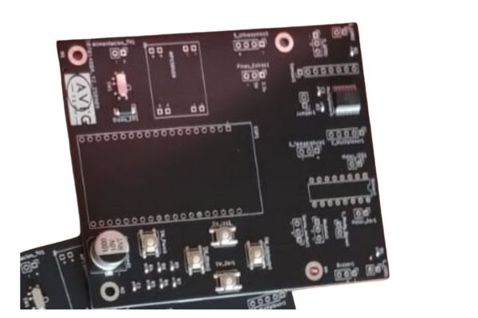

	PCB -  RENA RENA-BOT

Entre los principales elementos que incorpora se encuentran: 

.. list-table::
   :header-rows: 1
   :widths: 8 28 66
   :class: fit-table

   * - N
     - Elemento
     - Descripción
   * - 1
     - Microcontrolador ESP32-WROOM-32 (SMD)
     - Módulo WiFi + Bluetooth con doble núcleo Xtensa LX6 a 240 MHz, 520 KB de SRAM y hasta 16 MB de flash externa. Control principal del RENA-BOT.
   * - 2
     - Regulador de voltaje MP1584EN (step-down, 3A)
     - Conversor DC-DC buck que convierte 7.4 V de la batería LiPo a 5 V estables para lógica y periféricos. Alta eficiencia y hasta 3 A.
   * - 3
     - Diodo Schottky
     - Protección por polaridad inversa y mejora de eficiencia gracias a su baja caída de tensión.
   * - 4
     - Conector USB tipo C
     - Programación del ESP32 y alimentación auxiliar durante pruebas.
   * - 5
     - Conectores Molex JST XH2.54 (2, 3 o 4 pines)
     - Conexión rápida y segura para sensores, actuadores y expansiones.
   * - 6
     - Multiplexor analógico 74HC4067 (16 canales)
     - Expansión de entradas analógicas/digitales usando 4 pines de control.
   * - 7
     - Driver de motores L293D
     - Puente H dual para dos motores DC con control de dirección y PWM.
   * - 8
     - Pulsadores SMD
     - Entradas para la selección manual de movimiento del RENA-BOT en el modo seguidor de línea.
   * - 9
     - Sensores LDR 
     - El sensor LDR (Light Dependent Resistor) integrado en la placa posee unas dimensiones de 5 mm de diámetro.
   * - 10
     - Switch SMD 
     - Entrada para la selección de conexión con el RENA-BOT, como cliente WiFi o punto de acceso WiFi.

Sensores
--------

El RENA-BOT incluye la siguiente lista de sensores, los cuales permiten que el robot interactúe con su entorno y ejecute diferentes actividades educativas:  

Seguidor de línea
~~~~~~~~~~~~~~~~~

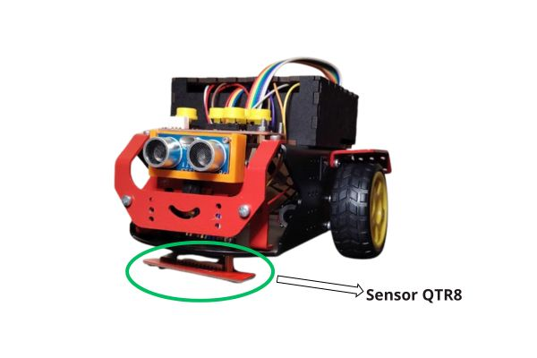

   Sensor QTR8 en el RENA-BOT

El sensor ``QTR8`` está compuesto por un arreglo de 8 sensores infrarrojos (IR) que permiten detectar el contraste entre superficies claras y oscuras.  
Funciona emitiendo luz infrarroja y midiendo la cantidad de reflexión en el suelo: superficies claras reflejan más y las oscuras menos.  

Características técnicas:  
- Tipo: arreglo de sensores IR reflectivos.  
- Canales: 8 independientes.  
- Salida: analógica. 
- Voltaje de operación: 3.3 V.  

Uso en el RENA-BOT:  
- Seguimiento de trayectorias y circuitos impresos en el suelo.  
- Implementación de robots seguidores de línea en competiciones educativas.  
- Desarrollo de proyectos como laberintos y rutinas de navegación autónoma.  

Sensor de distancia
~~~~~~~~~~~~~~~~~~~

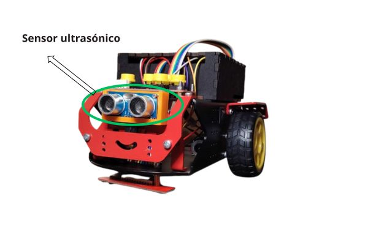

   Sensor ultrasónico en el RENA-BOT

El sensor ultrasónico HC-SR04 mide la distancia hasta un objeto enviando un pulso ultrasónico y calculando el tiempo que tarda en reflejarse.  

Características técnicas:  
- Rango de medición: 2 cm a 400 cm.  
- Precisión: ±3 mm.  
- Ángulo de detección: ~15°.  
- Voltaje de operación: 5 V.  

Uso en el RENA-BOT:  
- Evitación de obstáculos durante el recorrido.  
- Implementación de sistemas de detención automática cuando un objeto se acerca.   

Sensor de intensidad lumínica
~~~~~~~~~~~~~~~~~~~~~~~~~~~~~

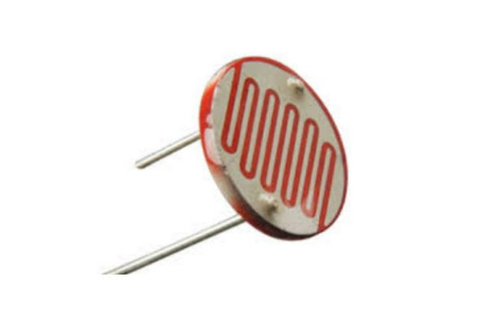

	sensor LDR

El sensor **LDR (Light Dependent Resistor)** varía su resistencia eléctrica según la cantidad de luz que incide sobre él.  
Se utiliza como un divisor de tensión, conectado a una entrada analógica del microcontrolador.  

Características técnicas:  
- Rango espectral: 400 – 700 nm (luz visible).  
- Tiempo de respuesta: 20 – 30 ms.  
- Voltaje de operación: 3.3 V – 5 V.  

Uso en el RENA-BOT:  
- Detectar niveles de luz y oscuridad.  
- Encender automáticamente LEDs cuando baja la iluminación.  
- Ejercicios de programación donde el robot reaccione a condiciones ambientales.  

Módulo Sensor de Temperatura  KY-028
~~~~~~~~~~~~~~~~~~~~~~~~~~~~~~~~~~~~~~~~~~~

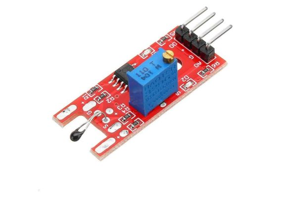

   Sensor Ky-028

El **Módulo Sensor de Temperatura Digital KY-028** combina un sensor NTC (Negative Temperature Coefficient) con un comparador LM393, lo que permite obtener tanto salida analógica (proporcional a la temperatura) como salida digital (según un umbral definido).  
Este diseño lo hace versátil para actividades educativas, ya que el usuario puede medir variaciones de temperatura y, al mismo tiempo, configurar condiciones de activación mediante el potenciómetro integrado.

Características técnicas:  
- Rango de medición: aproximadamente -20 °C a +100 °C.  
- Tipo de salida: analógica (variable continua) y digital (por umbral configurado).  
- Voltaje de operación: 3.3 V.  
- Sensibilidad ajustable mediante potenciómetro.  
- Indicador LED integrado para la salida digital.  

Uso en el RENA-BOT:  
- Medición de temperatura ambiental en actividades de exploración científica.  
- Activación de alarmas o actuadores al superar un umbral de temperatura predefinido.  
- Ejercicios de programación que combinen lecturas analógicas y digitales.  
- Proyectos de automatización educativa, relacionando condiciones térmicas con acciones específicas del robot.

Módulo Sensor de Sonido KY-037
~~~~~~~~~~~~~~~~~~~~~~~~~~~~~~

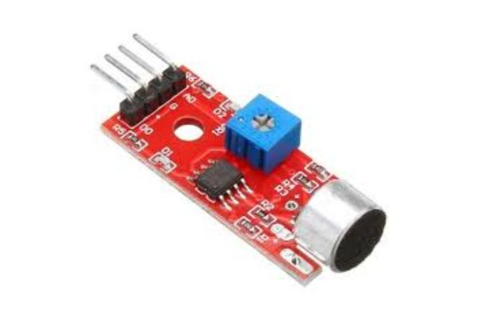

   Sensor KY-037 

El Módulo Sensor de Sonido KY-037 está diseñado para detectar la intensidad del sonido en el ambiente mediante un micrófono electret y un amplificador integrado.  
Proporciona tanto salida analógica (nivel proporcional a la intensidad sonora) como salida digital (activada al superar un umbral ajustable mediante potenciómetro).  

Características técnicas:  
- Tipo de sensor: micrófono electret con amplificador.  
- Salidas: analógica (A0) y digital (D0).  
- Voltaje de operación: 3.3 V.  
- Sensibilidad ajustable con potenciómetro.  
- Indicador LED para la salida digital.  

Uso en el RENA-BOT:  
- Detección de aplausos o sonidos fuertes para activar acciones del robot.  
- Proyectos de interacción sonora, donde el robot responde a estímulos acústicos.  
- Ejercicios de programación que combinen niveles de intensidad sonora con decisiones lógicas.  
- Actividades lúdicas como el control del robot mediante señales sonoras simples (ejemplo: avance con un aplauso).  

Actuadores
----------

El RENA-BOT incluye la siguiente lista de actuadores, los cuales permiten que el robot realice acciones físicas:  

Motores DC
~~~~~~~~~~

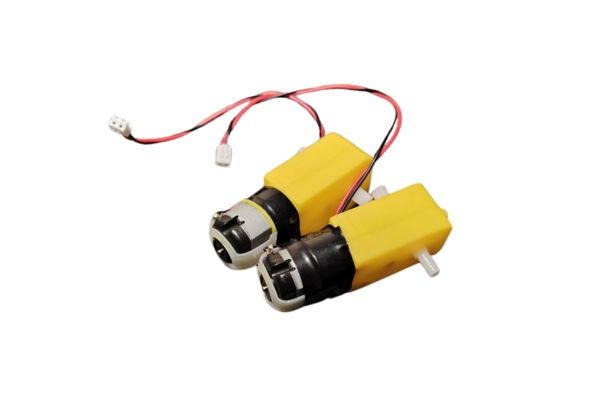

Los **motores de corriente directa (DC)** son los responsables del movimiento del robot.  
Están acoplados a reductores que aumentan el torque y permiten manejar con mayor precisión la velocidad y dirección del motor.

Características técnicas:  
- Voltaje de operación: 6 – 9 V.  
- Velocidad nominal: 150 RPM (sin carga).  

Uso en el RENA-BOT:  
- Desplazamiento mediante control diferencial (variando la velocidad de cada rueda).  
- Implementación de rutinas de navegación en trayectorias rectas, curvas o giros.  
- Actividades prácticas para enseñar conceptos de cinemática de robots móviles.

Servomotor
~~~~~~~~~~

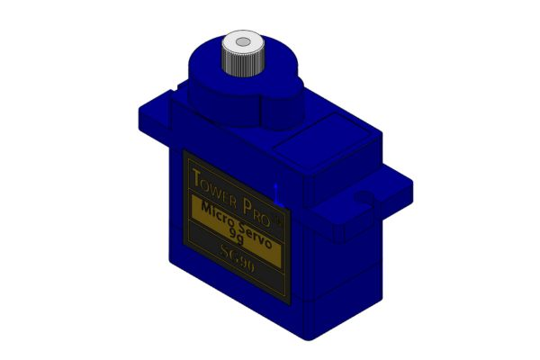

El **servomotor SG90** es un actuador de pequeño tamaño que permite un movimiento angular **0° a 360°**.  
Se controla enviando pulsos PWM desde el microcontrolador.  

Características técnicas:  
- Voltaje de operación: 4.8 V – 6 V.  
- Ángulo de rotación: 360º  
- Torque: ~1.8 kg·cm.  
- Peso: 9 g.  

Uso en el RENA-BOT:  
- Control de un manipulador de objetos o gripper.  
- Movimiento de sensores (por ejemplo, rotación de un sensor ultrasónico).  
- Actividades para enseñar el control de PWM y actuadores de precisión.  

Módulo de Buzzer Pasivo 
~~~~~~~~~~~~~~~~~~~~~~~~

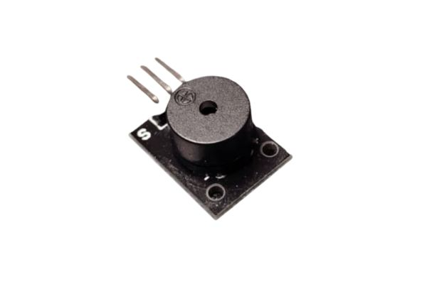

El **buzzer pasivo** es un actuador electrónico capaz de generar sonidos o tonos al recibir una señal de frecuencia desde el microcontrolador.  
A diferencia del buzzer activo, que emite un tono fijo con solo aplicarle voltaje, el buzzer pasivo requiere que se le envíen **señales PWM** para producir distintos sonidos y melodías.

Características técnicas:  
- Tipo: buzzer pasivo.  
- Voltaje de operación: 3.3 V – 5 V.  
- Control mediante señal PWM.  
- Tamaño compacto, fácil de integrar en la placa o en módulos externos.  

Fuente de energía
-----------------

El RENA-BOT utiliza una batería recargable **LiPo (Polímero de Litio) de 2 celdas (2S), 7.4 V, 1500 mAh y 35C**.  

Características principales:  
- **Voltaje nominal:** 7.4 V (3.7 V por celda).  
- **Capacidad:** 1500 mAh, lo que ofrece un tiempo de operación adecuado para actividades educativas de corta y mediana duración.  
- **Tasa de descarga:** 35C, permitiendo suministrar la corriente suficiente para los motores y actuadores del robot sin caídas de voltaje.  

Recomendaciones de seguridad:  
- Nunca descargar la batería por debajo de **6.0 V (3.0 V por celda)**, ya que puede dañarse permanentemente.  
- Utilizar siempre un cargador balanceado para LiPo, que garantice la seguridad y prolongue la vida útil de la batería.  
- Evitar golpes, perforaciones o exposición a altas temperaturas.  
- Durante el almacenamiento prolongado, mantener la batería en un nivel de **carga de almacenamiento (~3.8 V por celda)**.  

.. tip::
   Con un uso responsable, esta batería puede tener una larga vida útil y es suficiente para múltiples sesiones educativas antes de requerir recarga.

Conexión de los componentes
---------------------------

El diseño SMD de la placa de contro con sus conectores JST XH2.54 y sumado al sistema de colores, permite
identificar de forma sencilla la conexión de cada componente.

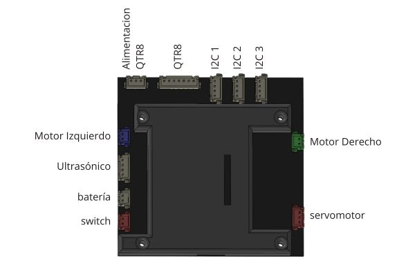

continúa aprendiendo sobre el RENA-BOT en la sección Software y Programación