Componentes Electrónicos
========================

Placa de Control
----------------

La placa de control del RENABOT contiene un diseño PCB/SMD optimizado para educación.  
Permite la integración de motores, sensores y actuadores de manera ordenada, con conectores accesibles y pines de expansión para futuros proyectos.  
Está basada en un microcontrolador ``ESP32 WROOM``, lo que brinda flexibilidad para programar 
el robot con distintos entornos como Arduino IDE, Micro-Python o FreeRTOS.  

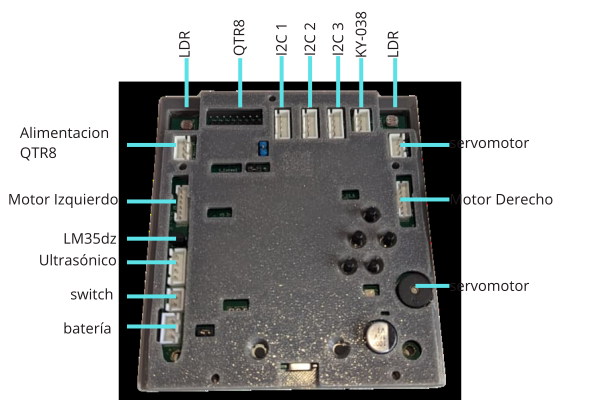
   
   Cerebro del Renabot

`Repositorio ESP32-STEM <https://avigtech-labs.github.io/ESP32-STEM/>`_

Características
~~~~~~~~~~~~~~~

La placa de control del RENABOT ha sido diseñada con un ensamblaje de montaje superficial, lo que garantiza un acabado compacto, ligero y confiable.  
Sus dimensiones son 95 x 92 x 2 mm, cuenta con recubrimiento protector para mayor durabilidad y resistencia, y está optimizada para integrar de forma ordenada los diferentes módulos del robot en formato
plug and play.  

   
   ESP32-STEM

Entre los principales elementos que incorpora se encuentran: 

.. list-table::
   :header-rows: 1
   :widths: 8 28 66
   :class: fit-table

   * - N
     - Elemento
     - Descripción
   * - 1
     - Microcontrolador ESP32-WROOM-32
     - Módulo WiFi + Bluetooth con doble núcleo Xtensa LX6 a 240 MHz, 520 KB de SRAM y hasta 16 MB de flash externa. Control principal del RENABOT.
   * - 2
     - Regulador de voltaje MP1584EN
     - Conversor DC-DC buck que convierte 7.4 V de la batería LiPo a 5 V estables para lógica y periféricos. Alta eficiencia y hasta 3 A.
   * - 3
     - Diodo de protección.
     - Protección por polaridad inversa y mejora de eficiencia gracias a su baja caída de tensión.
   * - 4
     - Conector USB tipo C
     - Programación del ESP32 y alimentación auxiliar durante pruebas.
   * - 5
     - Conectores Molex JST XH y PH
     - Conexión rápida y segura para sensores, actuadores y expansiones.
   * - 6
     - Multiplexor analógico 74HC4067 
     - Expansión de 16 entradas analógicas/digitales usando 4 pines de control.
   * - 7
     - Driver de motores TB6612FNG
     - Controlador de motores DC de doble canal. Permite controlar dirección y velocidad mediante señales PWM desde el ESP32. Voltaje de operacion de 2.5 a 13 [v] y 1.2 [A] nominal por canal.
   * - 8
     - Expansor GPIO PCF8574T
     - Expansor de pines digitales mediante comunicación I2C, utilizado para aumentar la cantidad de entradas/salidas disponibles.
   * - 9
     - Sensores LDR 
     - El sensor LDR (Light Dependent Resistor) integrado en la placa posee unas dimensiones de 5 mm de diámetro.
   * - 10
     - Switch SMD 
     - Entrada para la selección de conexión con el RENA-BOT, como cliente WiFi o punto de acceso WiFi.
   * - 11
     - Puente USB a UART
     - Chip encargado de la conversión USB a comunicación serial UART, utilizado para la programación y depuración del ESP32.
   * - 12 
     - LED RGB
     - LED SMD RGB.

Sensores
--------

El RENA-BOT incluye la siguiente lista de sensores, los cuales permiten que el robot interactúe con su entorno y ejecute diferentes actividades educativas:  

Seguidor de línea
~~~~~~~~~~~~~~~~~

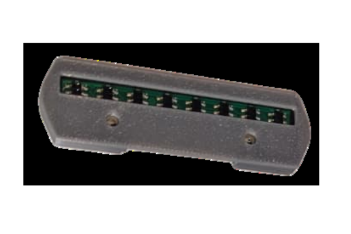
   
   Sensor QTR8 en el RENA-BOT

El sensor ``QTR8`` está compuesto por un arreglo de 8 sensores infrarrojos (IR) que permiten detectar el contraste entre superficies claras y oscuras.  
Funciona emitiendo luz infrarroja y midiendo la cantidad de reflexión en el suelo: superficies claras reflejan más y las oscuras menos.  

Características técnicas:  
- Tipo: arreglo de sensores IR reflectivos.  
- Canales: 8 independientes.  
- Salida: analógica. 
- Voltaje de operación: 3.3 V.  

Uso en el RENA-BOT:  
- Seguimiento de trayectorias y circuitos impresos en el suelo.  
- Implementación de robots seguidores de línea en competiciones educativas.  
- Desarrollo de proyectos como laberintos y rutinas de navegación autónoma.  

Sensor de distancia
~~~~~~~~~~~~~~~~~~~

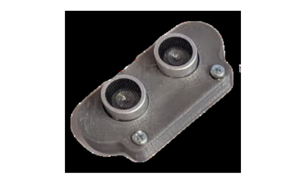

   Sensor ultrasónico en el RENABOT

El sensor ultrasónico HC-SR04 mide la distancia hasta un objeto enviando un pulso ultrasónico y calculando el tiempo que tarda en reflejarse.  

Características técnicas:  
- Rango de medición: 2 cm a 400 cm.  
- Precisión: ±3 mm.  
- Ángulo de detección: ~15°.  
- Voltaje de operación: 5 V.  

Uso en el RENA-BOT:  
- Evitación de obstáculos durante el recorrido.  
- Implementación de sistemas de detención automática cuando un objeto se acerca.   

Sensor de intensidad lumínica
~~~~~~~~~~~~~~~~~~~~~~~~~~~~~

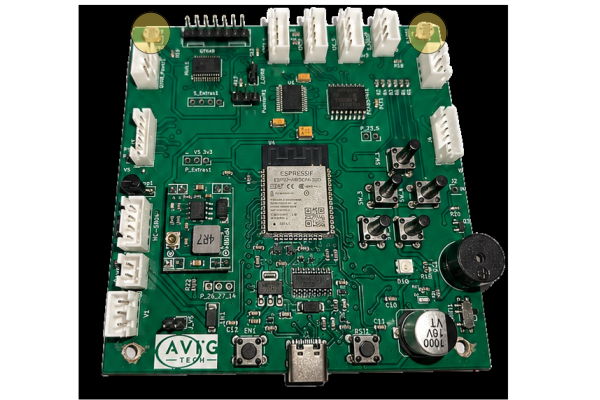
   
   Sensor LDR

El sensor **LDR (Light Dependent Resistor)** varía su resistencia eléctrica según la cantidad de luz que incide sobre él.  
Se utiliza como un divisor de tensión, conectado a una entrada analógica del microcontrolador.  

Características técnicas:  
- Rango espectral: 400 – 700 nm (luz visible).  
- Tiempo de respuesta: 20 – 30 ms.  
- Voltaje de operación: 3.3 V – 5 V.  

Uso en el RENA-BOT:  
- Detectar niveles de luz y oscuridad.  
- Encender automáticamente LEDs cuando baja la iluminación.  
- Ejercicios de programación donde el robot reaccione a condiciones ambientales.  

Módulo Sensor de Temperatura  LM35dz
~~~~~~~~~~~~~~~~~~~~~~~~~~~~~~~~~~~~~

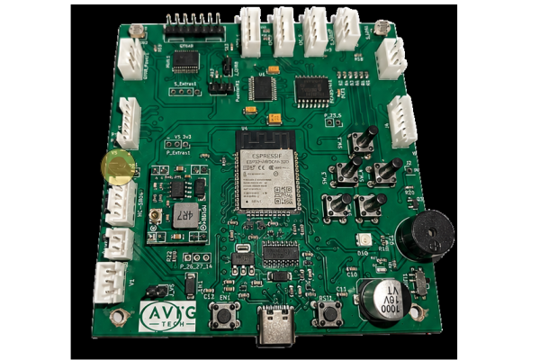
   
   Sensor LM35dz

El sensor de temperatura LM35DZ es un sensor analógico de precisión que proporciona una 
salida de voltaje lineal directamente proporcional a la temperatura medida. A diferencia 
de otros sensores que requieren calibraciones complejas, el LM35DZ entrega una señal fácil de interpretar, 
lo que lo convierte en una excelente opción para proyectos educativos y de automatización.
Características técnicas:

- Rango de medición: aproximadamente 0 °C a +100 °C.
- Tipo de salida: analógica.
- Voltaje de operación: 4 V a 30 V.
- Sensibilidad: 10 mV por cada grado Celsius.
- Precisión típica: ±0.5 °C a 25 °C.
- No requiere calibración externa.
- Bajo consumo de corriente (aproximadamente 60 µA).

Uso en el RENABOT:

- Medición de temperatura ambiental en actividades de exploración científica.
- Monitoreo de temperatura en experimentos STEM relacionados con transferencia de calor.
- Desarrollo de proyectos educativos de adquisición de datos utilizando entradas analógicas del ESP32.
- Activación de alarmas, indicadores visuales o actuadores cuando se alcancen determinadas temperaturas.

Módulo Sensor MPU6050
~~~~~~~~~~~~~~~~~~~~~~~~~~~~~~

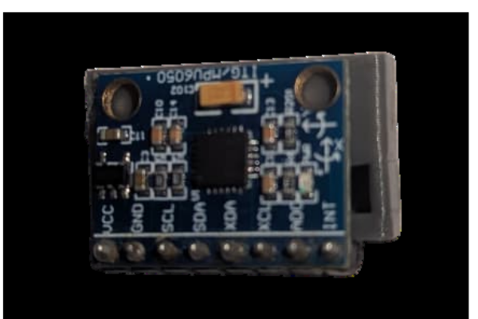
   
   MPU6050

El **MPU6050** es un sensor inercial de seis grados de libertad (6DOF) que integra un acelerómetro de tres ejes y un giroscopio de tres ejes en un solo dispositivo. Permite medir aceleraciones, inclinaciones y velocidades angulares, siendo ampliamente utilizado en aplicaciones de robótica, navegación y control de movimiento.

Características técnicas:
- Sensor 6DOF (3 ejes de aceleración + 3 ejes de velocidad angular).
- Comunicación: I2C.
- Voltaje de operación: 3.3 V – 5 V.
- Rango del acelerómetro: ±2g, ±4g, ±8g, ±16g.
- Rango del giroscopio: ±250, ±500, ±1000, ±2000 °/s.
- Convertidor ADC de 16 bits.
- Frecuencia de actualización configurable.
- Sensor de temperatura integrado.

Uso en el RENA-BOT:
- Medición de inclinación y orientación del robot.
- Implementación de sistemas de balanceo y estabilización.
- Detección de movimientos y cambios de posición.
- Desarrollo de algoritmos de navegación y control.
- Actividades educativas relacionadas con sensores inerciales y procesamiento de señales.

Pines adicionales para sensores
~~~~~~~~~~~~~~~~~~~~~~~~~~~~~~~

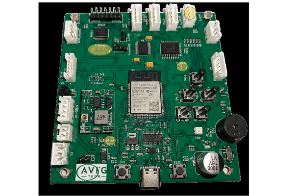
   
   Extras

La placa de control del **Renabot** ha sido diseñada para permitir 
la expansión de nuevos sensores y módulos electrónicos según las necesidades de cada proyecto.

Gracias a la incorporación del **multiplexor analógico 74HC4067**, es posible 
conectar hasta **5 señales analógicas adicionales**, permitiendo ampliar la capacidad de 
adquisición de datos sin consumir directamente más entradas analógicas del microcontrolador.

Esta característica facilita la integración de sensores como:

- Sensores de humedad.
- Sensores de gases.
- Potenciómetros y otros dispositivos analógicos.

Adicionalmente, la placa deja disponibles varios pines de propósito 
general (**GPIO**) del microcontrolador **ESP32-WROOM-32**, los cuales pueden 
utilizarse para conectar nuevos sensores, actuadores o módulos de comunicación.

GPIO disponibles para expansión:

- **GPIO 23**
- **GPIO 5**
- **GPIO 14**
- **GPIO 27**

Estos pines pueden configurarse como entradas o salidas digitales y permiten implementar 
funcionalidades adicionales como:

- Control de relés.
- Lectura de sensores digitales.
- Comunicación con módulos externos.
- Control de LEDs y actuadores.
- Desarrollo de proyectos personalizados.

.. note::
   Antes de conectar nuevos dispositivos, verifique la compatibilidad de voltajes y corrientes con las especificaciones del ESP32-WROOM-32 para evitar daños en la placa de control.

Actuadores
----------

El Renabot incluye la siguiente lista de actuadores, los cuales permiten que el robot realice acciones físicas:  

Motores DC con encoder
~~~~~~~~~~~~~~~~~~~~~~~

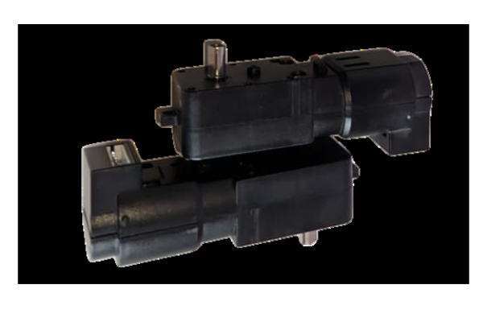

Los motores DC de cuadratura tipo TT con encoder Hall son los encargados del movimiento del robot. Incorporan un reductor mecánico y un encoder de cuadratura AB que permite medir velocidad y desplazamiento para implementar sistemas de control de precisión.

Características técnicas:

- Voltaje nominal: 6 V.
- Corriente nominal: 0.3 A.
- Corriente de bloqueo: 1.1 A.
- Relación de reducción: 1:45.
- Velocidad de salida: 355 RPM ±5%.
- Encoder Hall de cuadratura AB.
- Resolución del encoder: 13 líneas.
- Alimentación del encoder: 3.3 V – 5 V.
- Máximo conteo por revolución de rueda: 2340 pulsos.

Uso en el RENABOT:

- Desplazamiento mediante control diferencial.
- Medición de velocidad y distancia recorrida mediante encoders.
- Implementación de control PID de velocidad y posición.
- Desarrollo de algoritmos de navegación, odometría y seguimiento de trayectorias.
- Proyectos educativos relacionados con control de robots móviles y sistemas de retroalimentación.

Servomotor
~~~~~~~~~~

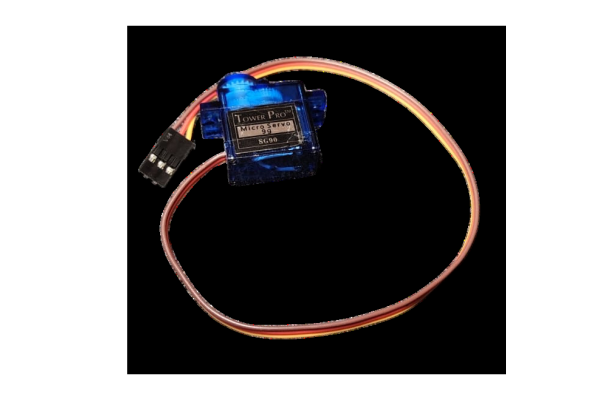

El **servomotor SG90** es un actuador de pequeño tamaño que permite un movimiento angular **0° a 360°**.  
Se controla enviando pulsos PWM desde el microcontrolador.  

Características técnicas:  

- Voltaje de operación: 4.8 V – 6 V.  
- Ángulo de rotación: 360º  
- Torque: ~1.8 kg·cm.  
- Peso: 9 g.  

Uso en el Renabot:  

- Control de un manipulador de objetos o gripper.  
- Movimiento de sensores (por ejemplo, rotación de un sensor ultrasónico).  
- Actividades para enseñar el control de PWM y actuadores de precisión.  

Buzzer 
~~~~~~~~~~~~~~

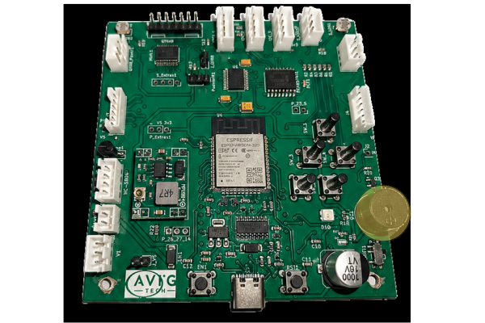

El **buzzer pasivo** es un actuador electrónico capaz de generar sonidos o tonos al recibir una señal de frecuencia desde el microcontrolador.  
A diferencia del buzzer activo, que emite un tono fijo con solo aplicarle voltaje, el buzzer pasivo requiere que se le envíen **señales PWM** para producir distintos sonidos y melodías.

Características técnicas:  

- Tipo: buzzer pasivo.  
- Voltaje de operación: 3.3 V – 5 V.  
- Control mediante señal PWM.  
- Tamaño compacto, fácil de integrar en la placa o en módulos externos.  

Pantalla OLED
~~~~~~~~~~~~~~

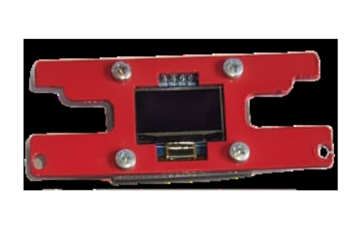

La **pantalla OLED I2C de 0.96 pulgadas (128x64)** es un dispositivo de visualización gráfica monocromática que utiliza tecnología OLED (Organic Light Emitting Diode), permitiendo mostrar texto, números, gráficos e iconos con alto contraste y bajo consumo energético.

Características técnicas:

- Tamaño de pantalla: 0.96 pulgadas.
- Resolución: 128 × 64 píxeles.
- Comunicación: I2C.
- Voltaje de operación: 3.3 V – 5 V.
- Controlador: SSD1306.
- Color de visualización: blanco monocromático.
- Bajo consumo de energía.
- Amplio ángulo de visión.

Uso en el RENA-BOT:

- Visualización de información del sistema.
- Monitoreo de variables y sensores en tiempo real.
- Indicadores de estado de conexión y funcionamiento.
- Presentación de mensajes, menús y configuraciones.
- Desarrollo de interfaces gráficas educativas para proyectos de robótica y automatización.

LED RGB
~~~~~~~~~~~~~~

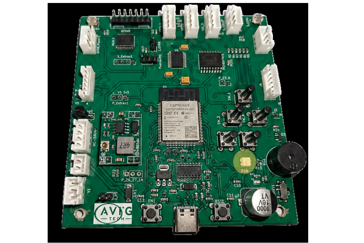

El **SK6812 RGB SMD** es un LED inteligente direccionable que integra en un solo encapsulado un LED RGB y un circuito controlador digital. Permite controlar individualmente el color y brillo de cada LED mediante una única línea de datos, facilitando la creación de efectos visuales dinámicos e indicadores luminosos programables.

Características técnicas:

- Tipo: LED RGB direccionable.
- Comunicación: señal digital de un solo cable (DIN).
- Voltaje de operación: 3.5 V – 5.5 V.
- Colores: rojo, verde y azul (RGB).
- Control individual de color y brillo.
- Encapsulado SMD compacto.
- Conexión en cascada mediante DIN y DOUT.
- Compatible con microcontroladores como ESP32 y Arduino.

Uso en el RENA-BOT:

- Indicadores visuales de estado y funcionamiento.
- Representación de alarmas y notificaciones mediante colores.
- Efectos luminosos programables para actividades educativas.
- Visualización del estado de sensores y comunicaciones.
- Desarrollo de proyectos relacionados con control digital de iluminación.

Fuente de energía
-----------------

El RENA-BOT utiliza una batería recargable **LiPo (Polímero de Litio) de 2 celdas (2S), 7.4 V, 2200 mAh y 35C**.  

Características principales:  

- **Voltaje nominal:** 7.4 V (3.7 V por celda).  
- **Capacidad:** 1500 mAh, lo que ofrece un tiempo de operación adecuado para actividades educativas de corta y mediana duración.  
- **Tasa de descarga:** 35C, permitiendo suministrar la corriente suficiente para los motores y actuadores del robot sin caídas de voltaje.  

Recomendaciones de seguridad:  

- Nunca descargar la batería por debajo de **6.0 V (3.0 V por celda)**, ya que puede dañarse permanentemente.  
- Utilizar siempre un cargador balanceado para LiPo, que garantice la seguridad y prolongue la vida útil de la batería.  
- Evitar golpes, perforaciones o exposición a altas temperaturas.  
- Durante el almacenamiento prolongado, mantener la batería en un nivel de **carga de almacenamiento (~3.8 V por celda)**.  

.. tip::
   Con un uso responsable, esta batería puede tener una larga vida útil y es suficiente para múltiples sesiones educativas antes de requerir recarga.

Conexión de los componentes
---------------------------

El diseño SMD de la placa de contro con sus conectores JST XH y sumado al sistema de colores, permite
identificar de forma sencilla la conexión de cada componente.

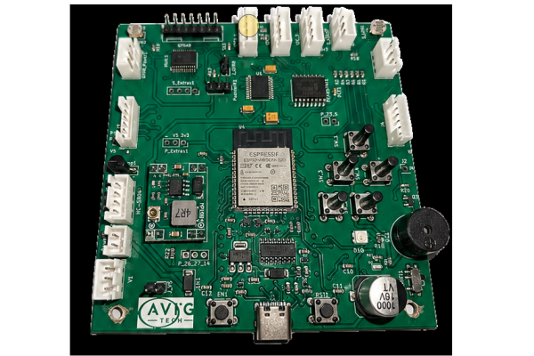

continúa aprendiendo sobre el RENABOT en la sección Software y Programación