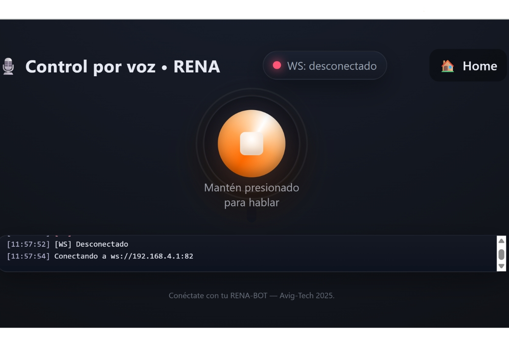
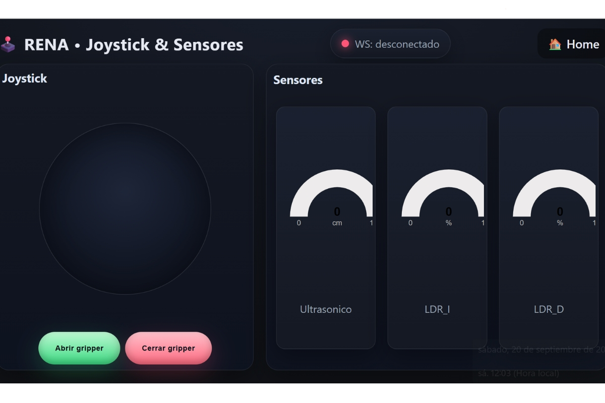

SOFTWARE Y PROGRAMACIÓN
=======================

El RENA-BOT es compatible con múltiples lenguajes y entornos de programación, lo que lo convierte en una plataforma flexible para el aprendizaje de la robótica.  
Puede ser utilizado con:

- **Arduino IDE** (C/C++).  
- **Espressif IDE** para desarrollos avanzados en ESP32.  
- **MicroPython**, orientado a programación ágil y didáctica.  
- **Blockly**, con bloques gráficos diseñados específicamente para simplificar la programación educativa.  

De esta manera, los estudiantes y docentes pueden elegir el entorno que mejor se adapte a su nivel y objetivos de aprendizaje.

Programación
------------

Bloques de programación del RENABOT
~~~~~~~~~~~~~~~~~~~~~~~~~~~~~~~~~~~~

Los bloques personalizados de Blockly permiten a los estudiantes activar el robot en diferentes modos y desarrollar algoritmos de forma visual e intuitiva.  

Descripción de bloques: 

.. list-table::
   :header-rows: 1
   :widths: 40 66 25
   :class: fit-table

   * - Bloque
     - Descripción
     - Clase
   * - .. image:: ./img/1.jpg
          :width: 180px
          :align: center
     - Este bloque permite el inicio del RENABOT, y le agrega un nombre para su funcionamiento.
     - Rena
   * - .. image:: ./img/2.jpg
          :width: 180px
          :align: center
     - Controla el movimiento del RENABOT en la malla de movimiento controlado, los movimientos disponibles son: Adelante, Atras, Izquierda, Derecha.
     - Rena
   * - .. image:: ./img/3.jpg
          :width: 180px
          :align: center
     - Setea el valor de la velocidad, usando un valor porcentual. El bloque permite valores enteros.
     - Rena
   * - .. image:: ./img/4.jpg
          :width: 180px
          :align: center
     - Controla el movimiento del robot durante una cantidad x de segundos, con este bloques el robot puede: Girar a la izquierda, Girar a la derecha, Avanzar o retroceder. El bloque admite valores decimales en el tiempo.
     - Rena
   * - .. image:: ./img/5.jpg
          :width: 180px
          :align: center
     - Abre o cierra el gripper.
     - Rena
   * - .. image:: ./img/6.jpg
          :width: 180px
          :align: center
     - Envia una pausa en la ejecución del algoritmo durante una x cantidad de tiempo. El bloque acepta valores decimales.
     - Rena
   * - .. image:: ./img/7.jpg
          :width: 180px
          :align: center
     - Enciende o apaga el LED del RENA-BOT
     - Rena
   * - .. image:: ./img/8.jpg
          :width: 180px
          :align: center
     - Actualiza el valor del sensor seleccionado, los sensores que se pueden leer son: ultrasónico, LDR izquierdo, LDR derecho, Temperatura, micrófono.
     - Sensor
   * - .. image:: ./img/9.jpg
          :width: 180px
          :align: center
     - Variable que usa el valor de las lecturas tomadas por el bloque de sensores.
     - Sensor
   * - .. image:: ./img/10.jpg
          :width: 180px
          :align: center
     - Bloque condicional IF, si la sentencia es verdadera se ejecutan los bloques agregados.
     - Condicional
   * - .. image:: ./img/11.jpg
          :width: 180px
          :align: center
     - Bucle For, repite un n número de veces los diferentes bloques agregados.
     - Condicional
   * - .. image:: ./img/12.jpg
          :width: 180px
          :align: center
     - Bucle If / Else, si se cumple las condición realiza las acciones agregadas en el if, sino realiza las acciones agregadas en el else.
     - Condicional
   * - .. image:: ./img/13.jpg
          :width: 180px
          :align: center
     - Compara 2 variables diferentes, los comparadores logicos disponibles son: ``!=``, ``==``, ``>``, ``<``, 
     - Comparador
   * - .. image:: ./img/14.jpg
          :width: 180px
          :align: center
     - Combina 2 o mas bloques comparadores.
     - Comparador
   * - .. image:: ./img/15.jpg
          :width: 180px
          :align: center
     - Devuelve una sentencia verdadera o falsa.
     - Comparador

Esto permite pasar de la programación visual a la codificación real, generando código fuente en Python o C++ de manera automática.

Formas de uso
-------------

El RENA-BOT puede ser utilizado de diferentes maneras, según la necesidad del curso o proyecto:

Modo Programador
~~~~~~~~~~~~~~~~

A través de bloques de programación (Blockly) el usuario puede manipular el comportamiento del RENA-BOT.  

.. figure:: ./img/programador.jpg
   :alt: modelorobot
   :align: center

Descripción del programa:

.. figure:: ./img/bloques_ejemplo.jpg
   :alt: modelorobot
   :align: center

Modo Control por Comandos de Voz 
~~~~~~~~~~~~~~~~~~~~~~~~~~~~~~~~

Este modo integra un módulo de reconocimiento de voz que permite controlar el robot mediante órdenes verbales simples activa los bloques de programacion.  
Se introducen así conceptos de **interacción humano-robot (HRI)** y de **inteligencia artificial aplicada a la educación**.  

Estructura del comando de voz

.. code-block:: bash
	
	Rena modo ``opcion de modo`` ``accion``  ``complemento`` 

Lista de comandos:

1. Movimiento libre del robot:

Rena modo libre ``accion`` durante ``tiempo`` segundos.

acción: ``adelante``, ``giro a la izquierda``, ``giro a la derecha``, ``atras``

tiempo: numero entero.

2. Movimiento en la malla del seguidor de línea del robot:

Rena modo seguidor ``accion``.

acción: ``adelante``, ``giro a la izquierda``, ``giro a la derecha``, ``atras``

3. Control de velocidad:

Rena modo velocidad al ``valor`` porciento.

valor: ``60`` , ``70``, ``80``, ``90``, ``100``

4. Control de gripper:

Rena modo gripper ``accion``.

acción: ``abrir``, ``cerrar``

**Modo Control Manual**  
La aplicación incluye un **joystick virtual** que permite controlar directamente la locomoción del robot.  
En paralelo, se muestra información en tiempo real de los sensores integrados (actualizada cada **100 ms**), lo que convierte al modo manual en una herramienta tanto de práctica como de monitoreo.  

Descargas
---------

Aplicación de escritorio
~~~~~~~~~~~~~~~~~~~~~~~~

La aplicación de escritorio es compatible con los siguientes sistemas operativos:  
- **Windows 10 / 11 (64 bits)**  
- **Ubuntu Linux 20.04 / 22.04**  
- **macOS Monterey o superior**  

:download:`Descargar aplicación de escritorio <_static/rena-bot-desktop.zip>`

Aplicación móvil
~~~~~~~~~~~~~~~~

La aplicación móvil está disponible para:  
- **Android (9.0 o superior)**  
- **iOS (13.0 o superior)**  

:download:`Descargar aplicación móvil <_static/rena-bot-app.apk>`

Arduino IDE
~~~~~~~~~~~

Enlace de descargar, AppImage
`arduino <https://www.arduino.cc/en/software/>`__