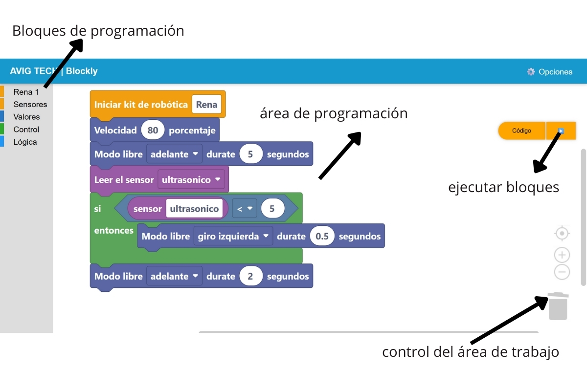
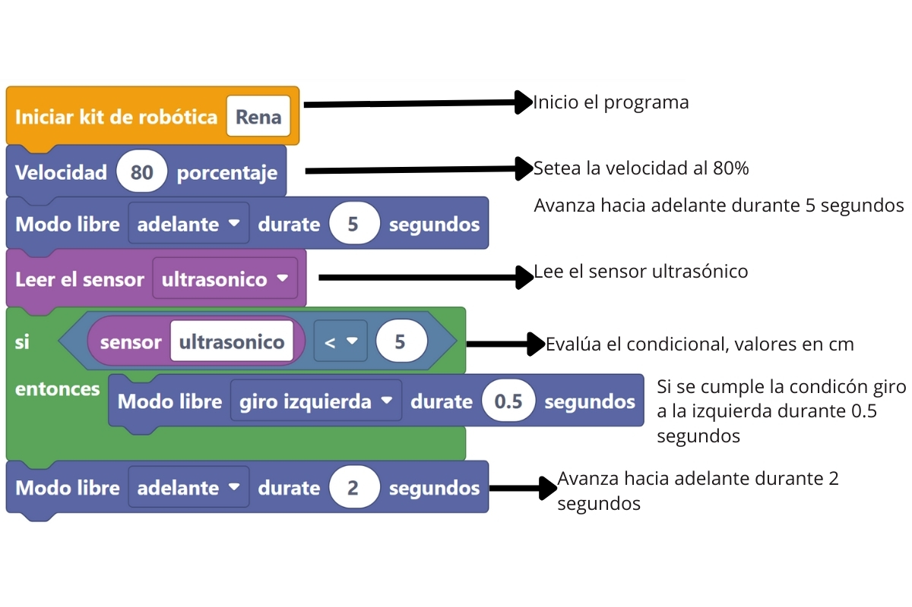

Software y Programación 
=======================

El Renabot es compatible con múltiples lenguajes y entornos de programación, lo que lo convierte en una plataforma flexible para el aprendizaje de la robótica.  
Puede ser utilizado con:

- **Arduino IDE** (C/C++).  
- **Espressif IDE** para desarrollos avanzados en ESP32.  
- **MicroPython**, orientado a programación ágil y didáctica.  
- **Blockly**, con bloques gráficos diseñados específicamente para simplificar la programación educativa.  

De esta manera, los estudiantes y docentes pueden elegir el entorno que mejor se adapte a su nivel y objetivos de aprendizaje.

Modo Programador
-----------------

A través de bloques de programación (Blockly) el usuario puede manipular el comportamiento del RENA-BOT.  

Descripción del programa:

Bloques de programación del RENABOT
~~~~~~~~~~~~~~~~~~~~~~~~~~~~~~~~~~~~

Los bloques personalizados de Blockly permiten a los estudiantes activar el robot en diferentes modos y desarrollar algoritmos de forma visual e intuitiva.  

Descripción de bloques: 

.. list-table::
   :header-rows: 1
   :widths: 40 66 25
   :class: fit-table

   * - Bloque
     - Descripción
     - Clase
   * - .. image:: ./img/rena.svg
          :width: 180px
          :align: center
     - Este bloque permite el inicio del RENABOT.
     - Rena
   * - .. image:: ./img/seguidor_malla.svg
          :width: 180px
          :align: center
     - Controla el movimiento del RENABOT en la malla de movimiento controlado, los movimientos disponibles son: Adelante, Atras, Izquierda, Derecha.
     - Rena
   * - .. image:: ./img/velocidad.svg
          :width: 180px
          :align: center
     - Setea el valor de la velocidad, usando un valor porcentual. El bloque permite valores enteros.
     - Rena
   * - .. image:: ./img/mov_libre.svg
          :width: 180px
          :align: center
     - Controla el movimiento del robot durante una cantidad x de segundos, con este bloques el robot puede: Girar a la izquierda, Girar a la derecha, Avanzar o retroceder. El bloque admite valores decimales en el tiempo.
     - Rena
   * - .. image:: ./img/gripper.svg
          :width: 180px
          :align: center
     - Abre o cierra el gripper.
     - Rena
   * - .. image:: ./img/esperar.svg
          :width: 180px
          :align: center
     - Envia una pausa en la ejecución del algoritmo durante una x cantidad de tiempo. El bloque acepta valores decimales.
     - Rena
   * - .. image:: ./img/led.svg
          :width: 180px
          :align: center
     - Enciende o apaga el LED del RENA-BOT
     - Rena
   * - .. image:: ./img/led.svg
          :width: 180px
          :align: center
     - Enciende o apaga el LED del RENA-BOT
     - Rena
   * - .. image:: ./img/bpm.svg
          :width: 180px
          :align: center
     - Setea el valor de Beats por minuto.
     - Rena
   * - .. image:: ./img/bpm.svg
          :width: 180px
          :align: center
     - Setea el valor de Beats por minuto.
     - Rena
   * - .. image:: ./img/musico.svg
          :width: 180px
          :align: center
     - Toca una nota musical por determinando tiempo [s]
     - Rena
   * - .. image:: ./img/musico_pro.svg
          :width: 180px
          :align: center
     - Toca una nota musical musical en base a una figura musical.
     - Rena
   * - .. image:: ./img/imagen.svg
          :width: 180px
          :align: center
     - Muestra en la pantalla oled una imagen.
     - Rena
   * - .. image:: ./img/matriz.svg
          :width: 180px
          :align: center
     - Crea una figura de 8 x 16 en la pantalla oled.
     - Rena
   * - .. image:: ./img/motor_ind.svg
          :width: 180px
          :align: center
     - Controla la velocidad de los motores de forma independiente.
     - Rena
   * - .. image:: ./img/variable_sensor.svg
          :width: 180px
          :align: center
     - Variable asignada a cada sensor.
     - Sensor
   * - .. image:: ./img/variable_sensor.svg
          :width: 180px
          :align: center
     - Variable asignada a cada sensor.
     - Sensor
   * - .. image:: ./img/matriz.svg
          :width: 180px
          :align: center
     - Bloque condicional IF, si la sentencia es verdadera se ejecutan los bloques agregados.
     - Condicional
   * - .. image:: ./img/for.svg
          :width: 180px
          :align: center
     - Bucle For, repite un n número de veces los diferentes bloques agregados.
     - Condicional
   * - .. image:: ./img/if_else.svg
          :width: 180px
          :align: center
     - Bucle If / Else, si se cumple las condición realiza las acciones agregadas en el if, sino realiza las acciones agregadas en el else.
     - Condicional
   * - .. image:: ./img/comparador_logico.svg
          :width: 180px
          :align: center
     - Compara 2 variables diferentes, los comparadores logicos disponibles son: ``!=``, ``==``, ``>``, ``<``, 
     - Comparador
   * - .. image:: ./img/comparador.svg
          :width: 180px
          :align: center
     - Combina 2 o mas bloques comparadores.
     - Comparador
   * - .. image:: ./img/while.svg
          :width: 180px
          :align: center
     - Ejecuta el bucle while
     - Comparador
   * - .. image:: ./img/true.svg
          :width: 180px
          :align: center
     - Devuelve una sentencia verdadera o falsa.
     - Comparador

Esto permite pasar de la programación visual a la codificación real, generando código fuente en Python o C++ de manera automática.

Descargas
---------

Aplicación de escritorio
~~~~~~~~~~~~~~~~~~~~~~~~

La aplicación de escritorio es compatible con los siguientes sistemas operativos:  
- **Windows 10 / 11 (64 bits)**  
- **Ubuntu Linux 20.04 / 22.04**  
- **macOS Monterey o superior**  

:download:`Descargar aplicación de escritorio <_static/rena-bot-desktop.zip>`

Aplicación móvil
~~~~~~~~~~~~~~~~

La aplicación móvil está disponible para:  
- **Android (9.0 o superior)**  
- **iOS (13.0 o superior)**  

:download:`Descargar aplicación móvil <_static/rena-bot-app.apk>`

Arduino IDE
~~~~~~~~~~~

Enlace de descargar, AppImage
`arduino <https://www.arduino.cc/en/software/>`__