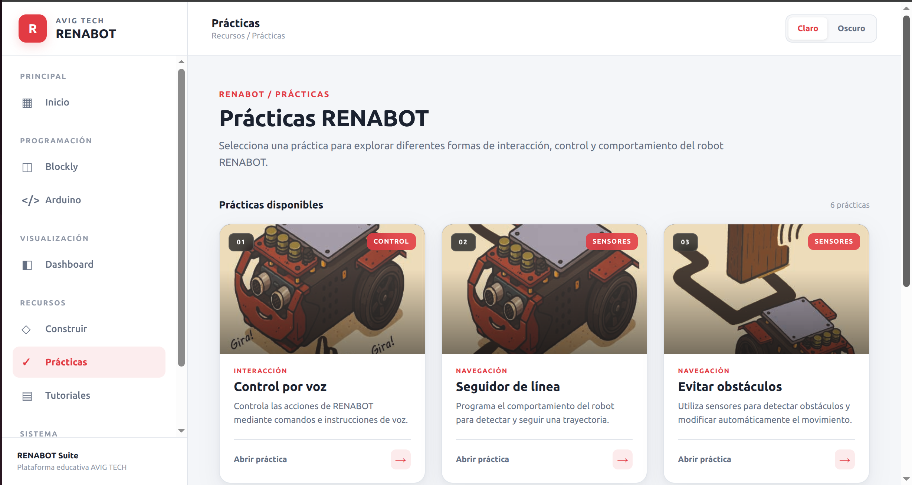
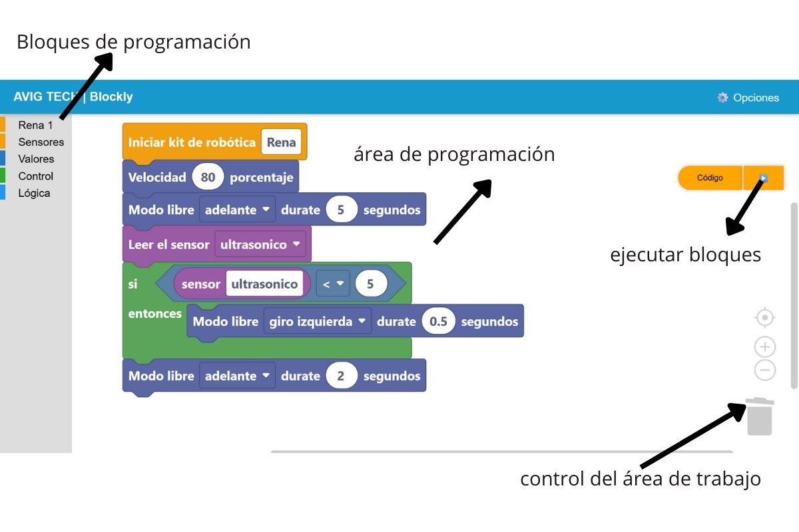
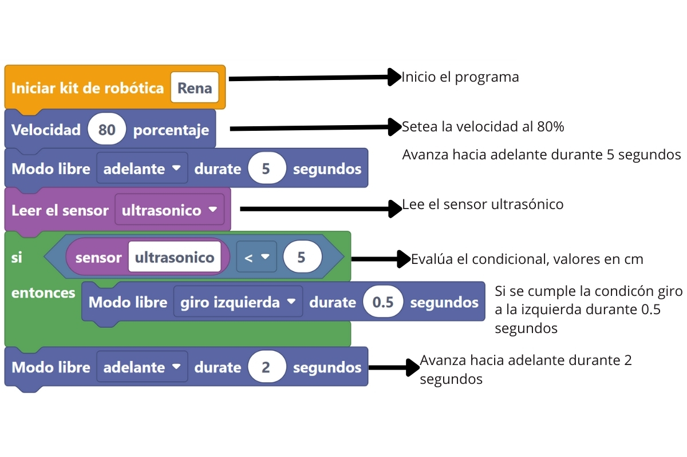

Ecosistema de software RENABOT
===================================

Renabot cuenta con un conjunto de herramientas de software diseñadas para facilitar
la programación, configuración y uso del robot tanto desde un computador como desde
un dispositivo móvil.

El ecosistema está compuesto principalmente por:

* **RENABOT Suite**, la aplicación principal para computador.
* **RENABOT Mobile**, la aplicación complementaria para dispositivos móviles.

Ambas herramientas permiten interactuar con Renabot de acuerdo con el tipo de
actividad que se desee realizar.

Renabot Suite
-------------

**RENABOT Suite** es la aplicación de escritorio compatible con Linux 
y windows para trabajar con Renabot.

Desde esta aplicación el usuario puede acceder a diferentes herramientas para
programar, simular, configurar y monitorear el robot.

Programación con bloques
~~~~~~~~~~~~~~~~~~~~~~~~

Renabot Suite incorpora un entorno de programación gráfica basado en bloques.

Este entorno permite crear programas desde actividades sencillas hasta algoritmos
con lógica, sensores y estructuras de control.

Descripción del programa:

**Bloques de programación del RENABOT**

Los bloques personalizados permiten a los estudiantes activar 
el robot en diferentes modos y desarrollar algoritmos de forma visual e intuitiva.  

Bloques Disponibles: 

.. list-table::
   :header-rows: 1
   :widths: 40 66 25
   :class: fit-table longtable

   * - Bloque
     - Descripción
     - Clase
   * - .. image:: ./img/rena.svg
          :width: 180px
          :align: center
     - Este bloque permite el inicio del RENABOT.
     - Rena
   * - .. image:: ./img/seguidor_malla.svg
          :width: 180px
          :align: center
     - Controla el movimiento del RENABOT en la malla de movimiento controlado, los movimientos disponibles son: Adelante, Atras, Izquierda, Derecha.
     - Rena
   * - .. image:: ./img/velocidad.svg
          :width: 180px
          :align: center
     - Setea el valor de la velocidad, usando un valor porcentual. El bloque permite valores enteros.
     - Rena
   * - .. image:: ./img/mov_libre.svg
          :width: 180px
          :align: center
     - Controla el movimiento del robot durante una cantidad x de segundos, con este bloques el robot puede: Girar a la izquierda, Girar a la derecha, Avanzar o retroceder. El bloque admite valores decimales en el tiempo.
     - Rena
   * - .. image:: ./img/gripper.svg
          :width: 180px
          :align: center
     - Abre o cierra el gripper.
     - Rena
   * - .. image:: ./img/esperar.svg
          :width: 180px
          :align: center
     - Envia una pausa en la ejecución del algoritmo durante una x cantidad de tiempo. El bloque acepta valores decimales.
     - Rena
   * - .. image:: ./img/led.svg
          :width: 180px
          :align: center
     - Enciende o apaga el LED del RENA-BOT
     - Rena
   * - .. image:: ./img/led.svg
          :width: 180px
          :align: center
     - Enciende o apaga el LED del RENA-BOT
     - Rena
   * - .. image:: ./img/bpm.svg
          :width: 180px
          :align: center
     - Setea el valor de Beats por minuto.
     - Rena
   * - .. image:: ./img/bpm.svg
          :width: 180px
          :align: center
     - Setea el valor de Beats por minuto.
     - Rena
   * - .. image:: ./img/musico.svg
          :width: 180px
          :align: center
     - Toca una nota musical por determinando tiempo [s]
     - Rena
   * - .. image:: ./img/musico_pro.svg
          :width: 180px
          :align: center
     - Toca una nota musical musical en base a una figura musical.
     - Rena
   * - .. image:: ./img/imagen.svg
          :width: 180px
          :align: center
     - Muestra en la pantalla oled una imagen.
     - Rena
   * - .. image:: ./img/matriz.svg
          :width: 180px
          :align: center
     - Crea una figura de 8 x 16 en la pantalla oled.
     - Rena
   * - .. image:: ./img/motor_ind.svg
          :width: 180px
          :align: center
     - Controla la velocidad de los motores de forma independiente.
     - Rena
   * - .. image:: ./img/variable_sensor.svg
          :width: 180px
          :align: center
     - Variable asignada a cada sensor.
     - Sensor
   * - .. image:: ./img/variable_sensor.svg
          :width: 180px
          :align: center
     - Variable asignada a cada sensor.
     - Sensor
   * - .. image:: ./img/matriz.svg
          :width: 180px
          :align: center
     - Bloque condicional IF, si la sentencia es verdadera se ejecutan los bloques agregados.
     - Condicional
   * - .. image:: ./img/for.svg
          :width: 180px
          :align: center
     - Bucle For, repite un n número de veces los diferentes bloques agregados.
     - Condicional
   * - .. image:: ./img/if_else.svg
          :width: 180px
          :align: center
     - Bucle If / Else, si se cumple las condición realiza las acciones agregadas en el if, sino realiza las acciones agregadas en el else.
     - Condicional
   * - .. image:: ./img/comparador_logico.svg
          :width: 180px
          :align: center
     - Compara 2 variables diferentes, los comparadores logicos disponibles son: ``!=``, ``==``, ``>``, ``<``, 
     - Comparador
   * - .. image:: ./img/comparador.svg
          :width: 180px
          :align: center
     - Combina 2 o mas bloques comparadores.
     - Comparador
   * - .. image:: ./img/while.svg
          :width: 180px
          :align: center
     - Ejecuta el bucle while
     - Comparador
   * - .. image:: ./img/true.svg
          :width: 180px
          :align: center
     - Devuelve una sentencia verdadera o falsa.
     - Comparador

Programación basada en Arduino
~~~~~~~~~~~~~~~~~~~~~~~~~~~~~~

Renabot Suite también dispone de herramientas para trabajar con programación de la ESP32.

Este módulo está orientado a usuarios que desean avanzar desde la programación por
bloques hacia el desarrollo de aplicaciones con microcontroladores.

Permite trabajar con conceptos como:

* Entradas y salidas digitales.
* Entradas analógicas.
* Sensores.
* Actuadores.
* Servomotores.
* Motores.
* Variables.
* Estructuras de control.

Visualización de sensores (Dashboard)
~~~~~~~~~~~~~~~~~~~~~~~~~~~~~~~~~~~~~~

Renabot Suite permite visualizar la información generada por el robot mediante
paneles gráficos.

Los datos de sensores pueden presentarse utilizando diferentes elementos de
visualización, como:

* Indicadores numéricos.
* Gráficos de línea.
* Gráficos de barras.
* Indicadores tipo ``gauge``.

Esto facilita la observación del comportamiento del robot durante una práctica.

Actividades y recursos educativos
~~~~~~~~~~~~~~~~~~~~~~~~~~~~~~~~~~

Renabot Suite también funciona como una herramienta de apoyo para el aprendizaje
de robótica.

La aplicación puede incluir:

* Prácticas guiadas.
* Tutoriales.
* Material de apoyo.
* Guías de construcción.
* Ejemplos de programación.
* Recursos para docentes y estudiantes.

De esta forma, el usuario puede acceder desde una misma aplicación a las
herramientas necesarias para construir, programar y experimentar con RENABOT.

Configuración de Renabot
~~~~~~~~~~~~~~~~~~~~~~~~

Desde RENABOT Suite también se pueden realizar tareas de configuración y
mantenimiento del robot.

Dependiendo del módulo utilizado, el usuario puede acceder a herramientas para:

* Configurar la comunicación con RENABOT.
* Verificar la conexión del robot.
* Configurar dispositivos.

Guías de construcción
~~~~~~~~~~~~~~~~~~~~~~~~

Utilizando modelos 3D del Renabot esta aplicación presenta un tutorial del armado de los diferentes
modos de construcción del Renabot.

Pŕacticas 
~~~~~~~~~~~

El Renabot tiene integrado 5 diferentes actividades programadas, que pueden ser utilizadas
según la necesidad del curso o proyecto. Las actividades incluidas son:

* Seguidor de línea
* Notas musicales
* Control manual
* Control por voz
* Andamiaje Robótico

Funcionamiento sin Internet
~~~~~~~~~~~~~~~~~~~~~~~~~~~~

Las principales herramientas de RENABOT Suite están diseñadas para funcionar de
manera local.

Esto permite utilizar, todos los recursos sin depender permanentemente de una conexión a Internet.

RENABOT Mobile
--------------

**RENABOT Mobile** es la aplicación complementaria para teléfonos y tabletas.

Su objetivo es permitir una interacción rápida con RENABOT sin necesidad de
utilizar un computador.

La aplicación está orientada principalmente al programación y realización
de actividades sencillas con el Renabot.

La aplicación móvil incluye:

* Programación por bloques.
* Tutoriales de construcción.
* Configuración del robot.
* Prácticas.

RENABOT Suite y RENABOT Mobile
------------------------------

Las dos aplicaciones se complementan entre sí.

**RENABOT Suite** está orientado al desarrollo completo de proyectos de robótica,
mientras que **RENABOT Mobile** facilita la interacción rápida con el robot.

De forma general:

.. list-table::
   :header-rows: 1
   :widths: 66 28 28
   :class: fit-table

   * - Función
     - Renabot Suite
     - Renabot Móvil
   * - Programación por bloques 
     - ✓
     - ✓
   * - Control del robot
     - ✓
     - ✓
   * - Visualización de sensores 
     - ✓
     - Parcial
   * - Programación ESP32
     - ✓
     - x
   * - Tutoriales y Actividades educativas 
     - ✓
     - x
   * - Prácticas
     - ✓ 
     - x

Además, el Renabot es compatible con múltiples lenguajes y entornos de programación, lo que lo 
convierte en una plataforma flexible para el aprendizaje de la robótica.  
Puede ser utilizado con:

- **Arduino IDE** (C/C++).  
- **Espressif IDE** para desarrollos avanzados en ESP32.  
- **MicroPython**, orientado a programación ágil y didáctica.  
- **Blockly**, con bloques gráficos diseñados específicamente para simplificar la programación educativa.  

De esta manera, los estudiantes y docentes pueden elegir el entorno que mejor se adapte a su nivel y objetivos de aprendizaje.