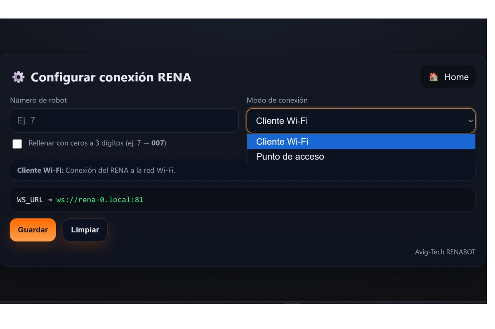

Configuracióndel Renabot
=========================

Conexión con el dispositivo
---------------------------

Una vez realizada la construcción del cualquier modelo del RenaBot, el primer paso para usar 
el Renabot es establecer una conexión wifi.

Para la conexión con el RENA-BOT se puede utilizar 2 modos:

Modo cliente:
~~~~~~~~~~~~~

En el modo cliente el rena se conecta a la red wifi disponible.

1. Revise las redes diponibles
2. Ingrese al portal general por el Rena-XX.
3. Ingrese las credencias de la Red Wifi a la que quieres acceder.
4. Espere a que la conexión se haya realizado.

Modo Acces Point:
~~~~~~~~~~~~~~~~~

1. Revise las redes diponibles
2. Ingrese al portal general por el Rena-XX.
3. Conectate a la red Wifi generada por el RENA-BOT.
4. Ingresa la contraseña rena1234.

Cada RENA-BOT tiene un número de identificación único.

Una vez realizada la conexión ya puedes utilizar tu Renabot
