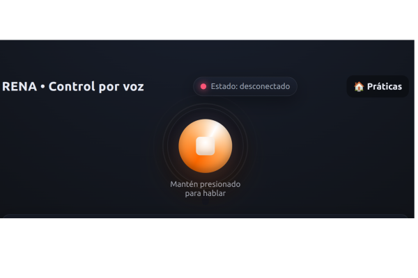
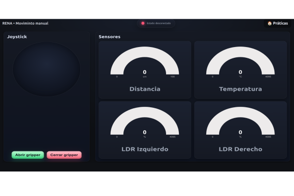
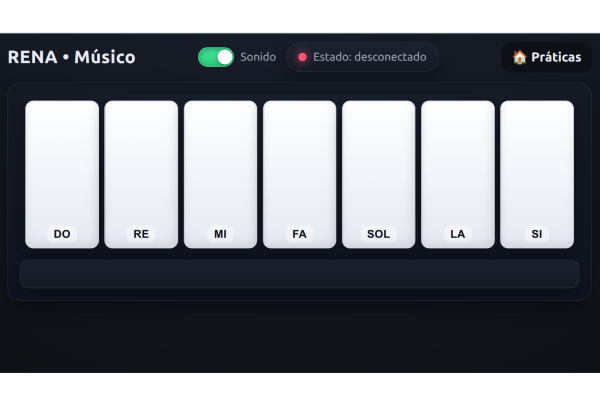
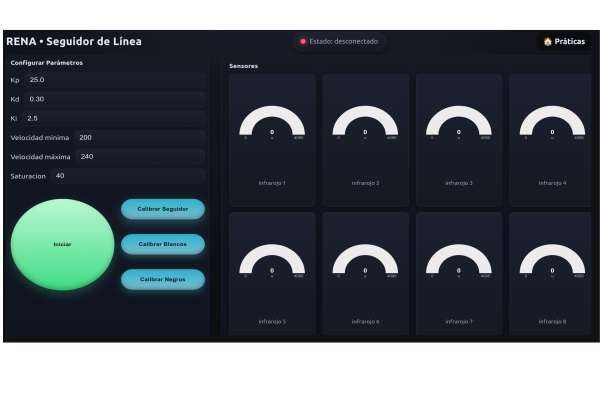

Actividades Renabot
===================

Pŕacticas
----------

El Renabot tiene integrado de diferentes programas, que pueden ser utilizadas
según la necesidad del curso o proyecto:

Control por Comandos de Voz
~~~~~~~~~~~~~~~~~~~~~~~~~~~

El **Modo de Control por Voz** permite interactuar con el RENA-BOT mediante instrucciones habladas en lenguaje natural.  
Este modo utiliza técnicas de **reconocimiento de voz (Speech Recognition)** para convertir la voz del usuario en texto y posteriormente aplicar procesos de análisis que permiten identificar las acciones que debe ejecutar el robot.

**Funcionamiento general**

El sistema sigue las siguientes etapas:

1. Captura de audio mediante el micrófono del dispositivo móvil o computador.
2. Conversión de voz a texto.
3. Procesamiento de la oración recibida.
4. Fragmentación de la frase en palabras clave.
5. Identificación de acciones, modos y parámetros.
6. Generación de comandos para el Renabot.
7. Ejecución de las acciones correspondientes.

De esta manera, el usuario puede comunicarse con el robot utilizando frases sencillas y naturales.

**Procesamiento del lenguaje**

Una vez convertida la voz en texto, el sistema realiza un proceso de análisis que incluye:

- Eliminación de palabras innecesarias.
- Identificación de verbos de acción.
- Reconocimiento de modos de operación.
- Extracción de parámetros numéricos.
- Interpretación de direcciones y movimientos.

Por ejemplo, la frase:

::

   Rena modo libre avanza adelante durante 2 segundos

es fragmentada en los siguientes elementos:

+----------------+-----------------------------+
| Elemento       | Valor identificado          |
+================+=============================+
| Robot          | Rena                        |
+----------------+-----------------------------+
| Modo           | Libre                       |
+----------------+-----------------------------+
| Acción         | Avanzar                     |
+----------------+-----------------------------+
| Dirección      | Adelante                    |
+----------------+-----------------------------+
| Tiempo         | 2 segundos                  |
+----------------+-----------------------------+

Posteriormente, el sistema transforma la frase en una secuencia de comandos internos que son enviados al robot.

Comandos disponibles

Rena

.. list-table::
   :header-rows: 1
   :widths: 28 66 30
   :class: fit-table

   * - Modo
     - Opciones
     - Argumentos
   * - Libre
     - Avanzar / Giro a la derecha / Giro a la Izquierda / Retroceder.
     - Tiempo en segundos
   * - Seguidor 
     - Avanzar / Giro a la derecha / Giro a la Izquierda / Giro 180 grados.
     - N/A
   * - Gripper
     - Abrir / Cerrar
     - N/A
   * - Setea
     - Velocidad
     - 10, 20, 30...100.

**Aplicaciones educativas**

El control por voz permite introducir conceptos relacionados con:

- Inteligencia Artificial.
- Procesamiento de Lenguaje Natural (NLP).
- Interacción Humano-Robot (HRI).
- Automatización basada en comandos.
- Sistemas embebidos conectados.

Además, facilita la interacción con estudiantes de diferentes edades al permitir controlar el robot mediante instrucciones habladas sin necesidad de escribir código.

.. note::

   El reconocimiento de voz depende de la calidad del micrófono, el ruido del entorno y el idioma configurado en el dispositivo utilizado.

.. _modo-libre:

Modo Control Manual  
~~~~~~~~~~~~~~~~~~~~

El **Modo Manual** permite controlar directamente el movimiento del **Renabot** mediante un **joystick virtual** integrado en la aplicación de escritorio o móvil.  
Este modo está diseñado para realizar pruebas de funcionamiento, actividades de exploración libre y control directo del robot durante prácticas educativas.

   Interfaz del Modo Manual del RENA-BOT

**Funcionamiento**

El usuario manipula el joystick virtual para enviar órdenes de movimiento al robot.  
Según la dirección seleccionada, el Renabot ejecuta acciones como avanzar, retroceder, girar a la izquierda, girar a la derecha o detenerse.

El funcionamiento general es el siguiente:

1. El usuario mueve el joystick virtual.
2. La aplicación interpreta la dirección del movimiento.
3. Se genera una orden de locomoción.
4. La orden se envía al RENA-BOT.
5. El robot ejecuta el movimiento usando sus motores.

**Control del gripper**

En la configuración de manipulador, el Modo Manual permite controlar el **gripper** mediante botones dedicados:

- **Abrir gripper:** activa el servomotor para liberar el objeto.
- **Cerrar gripper:** activa el servomotor para sujetar el objeto.

Esta función permite realizar actividades de transporte, recolección y manipulación de objetos pequeños.

**Visualización de sensores**

La interfaz muestra en tiempo real las mediciones de los sensores incorporados en el RENA-BOT.  
Estos datos permiten monitorear el comportamiento del robot durante su operación manual.

.. list-table::
   :header-rows: 1
   :widths: 30 70

   * - Sensor
     - Descripción
   * - Distancia
     - Muestra la distancia medida por el sensor ultrasónico, útil para identificar objetos cercanos durante la conducción.
   * - Temperatura
     - Presenta el valor de temperatura medido por el sensor integrado.
   * - LDR Izquierdo
     - Muestra el nivel de intensidad lumínica detectado en el lado izquierdo del robot.
   * - LDR Derecho
     - Muestra el nivel de intensidad lumínica detectado en el lado derecho del robot.

**Uso educativo**

El Modo Manual permite desarrollar actividades relacionadas con:

- Control remoto de robots móviles.
- Pruebas básicas de motores y actuadores.
- Lectura e interpretación de sensores.
- Manipulación de objetos mediante gripper.
- Exploración libre del entorno.
- Introducción a la interacción humano-robot.

.. note::

   Antes de utilizar el Modo Manual, verifique que el RENA-BOT se encuentre conectado correctamente a la aplicación y que la batería tenga carga suficiente.

Modo Músico
~~~~~~~~~~~~

El **Modo Músico** permite que el Renabot reproduzca notas musicales utilizando el **buzzer pasivo** incorporado en el robot.  
Desde la aplicación de escritorio o móvil, el usuario dispone de un **piano virtual** con notas básicas como **DO, RE, MI, FA, SOL, LA y SI**.

Al presionar una tecla del piano, la aplicación envía la nota seleccionada al Renabot.  
El robot interpreta esta orden y reproduce el sonido correspondiente mediante el buzzer, generando una frecuencia asociada a cada nota musical.

**Funcionamiento**

El proceso general del Modo Músico es el siguiente:

1. El usuario selecciona una nota musical en el piano virtual.
2. La aplicación identifica la nota presionada.
3. Se envía el comando correspondiente al RENA-BOT.
4. El robot recibe la orden.
5. El buzzer pasivo reproduce la frecuencia asociada a la nota musical.

   Interfaz del Modo Músico del RENA-BOT

Notas disponibles:  ``DO,RE,MI,FA,SOL,LA,SI`` .

**Aplicación educativa**

Este modo permite relacionar la robótica con conceptos básicos de **música, física y programación**.  
A través del buzzer, los estudiantes pueden comprender que cada nota musical está asociada a una frecuencia determinada.

El Modo Músico permite trabajar temas como:

- Frecuencia y sonido.
- Relación entre programación y música.
- Secuencias lógicas.
- Creatividad mediante melodías simples.

.. note::

   El sonido generado por el buzzer depende de la frecuencia enviada por el microcontrolador y de la duración definida para cada nota musical.

Modo Seguidor de Línea
~~~~~~~~~~~~~~~~~~~~~~~

El **Modo Seguidor de Línea** permite que el RENA-BOT se desplace de forma autónoma siguiendo una trayectoria marcada en el suelo, generalmente una **línea negra sobre una superficie clara**.  
Este modo utiliza el arreglo de sensores infrarrojos del robot para detectar el contraste de la pista y corregir constantemente la dirección de movimiento.

   Interfaz del Modo Seguidor de Línea del RENA-BOT

**Funcionamiento**

El sistema interpreta las lecturas de los sensores infrarrojos y ajusta la velocidad de los motores para mantener el robot centrado sobre la línea.  
Cuando el robot detecta una desviación hacia la izquierda o derecha, modifica la velocidad de cada motor para corregir su trayectoria.

El funcionamiento general es el siguiente:

1. El robot lee los valores de los sensores infrarrojos.
2. El sistema calcula la posición relativa de la línea.
3. Se determina el error de seguimiento.
4. El controlador ajusta la velocidad de los motores.
5. El robot corrige su dirección y continúa avanzando.

**Parámetros de control**

La aplicación permite configurar los parámetros principales del controlador utilizado para el seguimiento de línea.

.. list-table::
   :header-rows: 1
   :widths: 25 75

   * - Parámetro
     - Descripción
   * - Kp
     - Ganancia proporcional. Permite corregir el error actual entre la posición del robot y la línea detectada.
   * - Ki
     - Ganancia integral. Ayuda a corregir errores acumulados durante el seguimiento.
   * - Kd
     - Ganancia derivativa. Permite suavizar la respuesta del robot ante cambios bruscos en la trayectoria.
   * - Velocidad mínima
     - Define la velocidad base más baja permitida para los motores durante el seguimiento.
   * - Velocidad máxima
     - Define el límite superior de velocidad para evitar movimientos inestables.
   * - Saturación
     - Limita la corrección aplicada al sistema para evitar giros excesivos o respuestas agresivas.

**Calibración del seguidor**

Antes de iniciar el seguimiento de línea, es recomendable realizar la calibración de los sensores.  
La interfaz incluye botones específicos para este proceso:

- **Calibrar Seguidor:** ajusta los valores de referencia del arreglo de sensores.
- **Calibrar Blancos:** registra los valores correspondientes a la superficie clara.
- **Calibrar Negros:** registra los valores correspondientes a la línea negra.

Este proceso permite que el robot diferencie correctamente entre la pista y el fondo, mejorando la precisión del movimiento.

**Visualización de sensores**

La interfaz muestra en tiempo real los valores de los sensores infrarrojos del RENA-BOT.  
Cada indicador representa la lectura individual de un sensor, permitiendo observar cómo el robot interpreta la línea durante el recorrido.

Los valores pueden variar dentro del rango de lectura del microcontrolador, permitiendo identificar:

- Sensores ubicados sobre la línea.
- Sensores ubicados sobre la superficie clara.
- Cambios de contraste durante el recorrido.
- Posibles errores de calibración.

**Uso educativo**

El Modo Seguidor de Línea permite desarrollar actividades relacionadas con:

- Control automático de robots móviles.
- Uso de sensores infrarrojos.
- Conceptos de error y corrección.
- Control PID.
- Trayectorias, patrones y resolución de retos.
- Pensamiento lógico y planificación de rutas.

.. note::

   Para obtener mejores resultados, se recomienda utilizar pistas con buen contraste entre la línea y el fondo, además de realizar la calibración antes de iniciar cada práctica.

Aplicaciones
------------

Seguidor en Malla
~~~~~~~~~~~~~~~~~

Para esta modalidad necesitas la malla para el seguidor de linea.

Este modo se presenta como una implementación diseñada para maximizar la precisión de los movimientos del RENA-BOT, siendo especialmente útil en actividades educativas que priorizan:

* El desarrollo del pensamiento lógico-matemático básico, a través de tareas como contar, reconocer figuras y patrones, clasificar y comparar.

* El aprendizaje experiencial y lúdico, mediante actividades de exploración, prácticas guiadas y juegos interactivos.

Además, este modelo toma como referencia un toy problem relacionado con el almacenamiento inteligente y la optimización de rutas utilizando robots móviles.
Su aplicación más directa se observa en los robots industriales seguidores de línea utilizados por Amazon, que ejemplifican cómo un concepto didáctico puede escalar hacia soluciones de ingeniería avanzada en logística y automatización.

Para su uso puedes utilizar los bloques de ``seguidor`` y la opcion de control por voz utilizando el modo ``seguidor``

Versiones que soportan esta aplicacion: ``velocista``, ``transportador``, ``todoterreno``

Modo radar 
~~~~~~~~~~
En esta configuración, el Renabot emplea el sensor ultrasónico 
montado en un servomotor para realizar un barrido de hasta 270°, generando 
un mapa básico de los objetos que lo rodean. Paralelamente, el usuario puede manipular
el movimiento del robot de forma manual mediante un joystick virtual, lo que combina 
exploración autónoma con control interactivo.

.. note::

   Actualizacion en proceso.